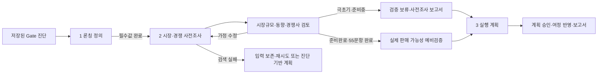

# AI GTM 론칭 정의·시장 사전조사·판매 가능성 예비검증 설계 및 구현 계획

작성일: 2026-08-10
범위: AI GTM 어시스턴트의 론칭 제품·서비스·솔루션 정의, 시장동향, 시장규모, 경쟁사 사전조사, 준비완료 후 실제 판매 가능성 예비검증, 창업자 확인, 단계별 실행계획 연결

## 0. Plan·Design 검토 결론

기존 제안의 방향은 유지하되 다음 다섯 가지를 보정한다.

1. 시장 규모와 경쟁 구도는 `기회의 크기`를 설명할 뿐 제품·서비스·솔루션이 실제로 팔린다는 증거가 아니다.
2. `극초기`와 `준비중`에서는 후속 고객 행동·지불·반복 구매 증거를 모두 모을 수 없으므로 판매 가능성을 판정하지 않는다.
3. 두 단계에서는 `AI 시장·경쟁 사전조사`, 검증할 가설, 다음에 수집할 증거를 제공하고 다운로드 보고서에 포함한다.
4. `준비완료`까지 55문항을 모두 답한 경우에만 55개 답변과 제출 증거를 사용해 `실제 판매 가능성 예비검증`을 제공한다. 미응답·잠김 문항은 실패나 0점으로 계산하지 않는다.
5. 하나의 성공확률 점수는 만들지 않는다. 고객 문제 적합성, 차별 가치, 현지 적합성, 지불 의사, 증거 강도를 근거별 상태로 보여준다.

이 검토는 실행 범위를 늘리지 않는다. 기존 3단계 작업영역, `founder_context`, 계획된 `market_research` JSONB, 55문항 데이터와 현재 CSS를 재사용한다.

| 현재 진단 범위 | AI 산출물 | 다운로드 보고서 |
| --- | --- | --- |
| 극초기 | 시장·경쟁 사전조사 + 검증 가설 + 다음 증거 | 포함 |
| 준비중 | 시장·경쟁 사전조사 + 검증 가설 + 다음 증거 | 포함 |
| 준비완료 문항까지 55개 모두 응답 | 시장·경쟁 사전조사 + 실제 판매 가능성 예비검증 | 포함 |

## 1. 결론

현재 화면의 문제는 입력 필드 하나가 빠진 수준이 아니다. `무엇을 론칭하는지` 모르는 상태에서 목표국가·목표고객만 받아 곧바로 단계별 실행계획(30·60·90 Day Plan)을 생성하므로, 시장규모와 경쟁 구도에 근거한 계획을 만들 수 없다.

AI GTM 어시스턴트를 다음 세 단계의 제한된 워크숍으로 바꾼다.

1. **론칭 정의**: 제품·서비스·솔루션, 고객 문제, 핵심 가치, 제공·수익 방식과 현재 검증 근거를 창업자가 확정한다.
2. **시장·경쟁 사전조사**: AI가 내부 위키와 공개 웹 자료를 사용해 시장동향, 시장규모, 주요 경쟁사와 확인 공백을 제시한다. `극초기·준비중`에서는 여기까지를 보고서로 제공한다. 준비완료까지 55문항을 모두 답한 경우에만 같은 단계 안에서 실제 판매 가능성 예비검증을 추가한다.
3. **실행 계획**: 창업자가 사전조사 범위와 가정을 확인한 뒤에만 진단 액션, 론칭 정의, 사전조사와 해당되는 경우의 판매 가능성 예비검증을 단계별 실행계획(30·60·90 Day Plan)의 근거로 사용한다.

자유 대화형 챗봇, 별도 검색 서비스, 차트 라이브러리는 추가하지 않는다. 기존 `/assistant/[assessmentId]`, Responses API의 `file_search`·`web_search`, `gtm_plans`와 CSS panel 패턴을 확장한다.

## 2. 현재 구현에서 확인한 간극

1. 화면은 `목표국가·목표고객·가용 자원·기한·제약`만 상태로 관리한다 (`components/gtm-assistant.tsx:51-57`).
2. 본문 제목도 초기 목표시장만 묻고, 같은 다섯 필드 뒤에 바로 `AI GTM 계획 만들기`를 제공한다 (`components/gtm-assistant.tsx:158-180`).
3. API 입력 검증과 필수 문맥 판정 역시 같은 다섯 필드만 허용한다 (`app/api/gtm-assistant/turn/route.ts:19-37`, `231-235`).
4. 모델 지시문은 진단 액션의 구체화와 실행계획 생성만 요구하며, 론칭 대상·시장규모·경쟁사 조사 결과 구조를 요구하지 않는다 (`app/api/gtm-assistant/turn/route.ts:246-267`).
5. 웹 검색은 목표국가가 있고 사용자 문장에 최신 사실 키워드가 있을 때만 켜진다. 시장 조사 자체를 명시적으로 실행하는 동작이 아니다 (`lib/gtm-assistant.ts:71-83`).
6. 모델 출력은 다음 질문 또는 실행계획만 허용한다. 시장 조사 결과를 반환할 구조가 없다 (`lib/gtm-assistant.ts:38-57`).
7. `gtm_plans.founder_context`는 JSONB라 론칭 문맥 필드는 즉시 확장할 수 있지만, 검토 가능한 시장 조사 결과를 저장할 전용 값은 없다 (`supabase/migrations/005_ai_gtm_assistant.sql:1-25`).
8. 진단에는 제품·서비스 선택 UI가 있지만 진단 한 번에만 남고 저장되지 않으며, 솔루션 유형과 실제 론칭 설명은 다루지 않는다 (`lib/intake-questions.ts:17-38`, `components/assessment-form.tsx:402-423`).
9. AI GTM API는 assessment 집계와 action item만 읽고 `readiness_answers`를 조회하지 않아, 55개 답변과 증거를 판매 가능성 예비검증의 근거로 사용할 수 없다 (`app/api/gtm-assistant/turn/route.ts:130-159`).

## 3. 요구사항 요약

### 필수 사용자 결과

- 창업자는 계획 생성 전에 글로벌 론칭 제품·서비스·솔루션을 명시한다.
- 창업자는 초기 목표국가와 고객이 무엇인지 함께 명시한다.
- AI는 해당 론칭 대상과 국가를 기준으로 시장동향, 시장규모, 주요 경쟁사를 사전조사한다.
- 시장규모는 전체시장(Total Addressable Market), 유효시장(Serviceable Available Market), 수익가능시장(Serviceable Obtainable Market), 초기 공략 가능 시장(Launchable Addressable Market)을 모두 포함한다.
- 창업자는 조사에 사용된 가정과 근거를 확인·수정한 뒤 계획 생성 여부를 결정한다.
- 극초기·준비중 결과에서는 실제 판매 가능성을 판정하지 않고 사전조사, 검증 가설, 다음 증거를 다운로드 보고서에 포함한다.
- 준비완료까지 55문항을 모두 답한 경우에만 실제 판매 가능성 예비검증을 제공한다.
- 예비검증은 55개 답변·증거와 사전조사를 구분해 표시하고, 성공확률이나 판매 보장을 제시하지 않는다.
- 확인된 조사 결과는 기존 Gate 판정과 진단 액션을 바꾸지 않고 실행계획을 구체화하는 근거로만 사용한다.

### 범위 밖

- AI가 Gate 점수 또는 통과 여부를 변경하는 기능
- 법률·세무·인증·계약의 확정 판단
- 자동 경쟁사 감시, 정기 크롤링, 별도 검색 인덱스
- 정밀 투자용 시장가치 평가 또는 재무 예측
- 준비완료 전 실제 판매 가능성 판정
- AI 추론만으로 유료 판매·반복 구매가 검증됐다고 선언하는 기능
- 단일 판매 성공확률 점수
- 새 상태관리·차트·검색 라이브러리

## 4. 용어와 시장규모 정의

사용자 화면에는 약어만 단독으로 쓰지 않는다.

| 항목 | 제품 내 정의 | 기본 산식 방향 |
| --- | --- | --- |
| 전체시장(Total Addressable Market) | 지역·채널·현재 자원 제약이 없을 때 론칭 대상이 해결하는 전체 수요 | 전체 잠재 고객 수 × 연간 고객당 수익 또는 공신력 있는 시장 총액 |
| 유효시장(Serviceable Available Market) | 목표국가, 산업, 규제, 언어, 제공방식으로 실제 서비스할 수 있는 부분 | 전체시장 × 서비스 가능 지역·세그먼트 비율 |
| 수익가능시장(Serviceable Obtainable Market) | 경쟁, 채널, 가격, 현재 검증 수준을 반영해 3년 안에 획득 가능한 부분 | 유효시장 × 현실적 점유율 범위 |
| 초기 공략 가능 시장(Launchable Addressable Market) | 12개월 안에 현재 인력·예산·채널·가격·규제 조건으로 실제 접촉하고 수주할 수 있는 시장 | 접촉 가능한 고객 수 × 전환율 범위 × 연간 고객당 수익 |

제품 규칙은 `0 ≤ 초기 공략 가능 시장 ≤ 수익가능시장 ≤ 유효시장 ≤ 전체시장`이다. 초기 공략 가능 시장은 보편 표준이라고 단정하지 않고 Borderless가 초기 실행 가능성을 표시하기 위해 사용하는 정의임을 도움말에 명시한다.

각 수치는 다음을 반드시 가진다.

- 낮음·기준·높음 추정 범위
- 금액 또는 고객 수 단위, 통화, 기준연도, 추정 기간
- 산식과 핵심 입력값
- 근거 출처 ID
- `외부 자료 / 창업자 입력 / AI 추정 / 확인 필요` 라벨
- 신뢰도 `높음 / 보통 / 낮음`과 제한

상향식 산정이 불가능하면 숫자를 지어내지 않고 `확인 필요`로 저장한다. 하향식 자료와 상향식 결과가 30% 이상 다르면 불일치 사유를 확인 공백으로 표시한다.

## 5. 화면 설계

### 전체 흐름



### 화면 상단

- 기존 좌측 진단 결과·Gate 사유·우선 액션 sidebar는 유지한다.
- 본문 상단에 `1 론칭 정의 / 2 시장·경쟁 사전조사 / 3 실행 계획` 단계 표시를 둔다.
- 현재 단계에는 `aria-current="step"`을 적용한다.
- 제목은 `초기 목표시장에 대하여 말씀해 주세요`에서 `무엇을 누구에게 어디에서 론칭하실지 정의해 주세요`로 바꾼다.

### 1단계 — 론칭 정의

기존 `.assistant-context.panel`의 2열 form 패턴을 재사용한다.

#### 필수 필드

| 필드 | 제어 | 예시 |
| --- | --- | --- |
| 론칭 유형 | radio 또는 segmented control | 제품 / 서비스 / 솔루션 / 복합 |
| 론칭명 | text | 제조 설비 예지보전 솔루션 |
| 한 문장 설명 | textarea | 센서 데이터로 고장을 사전에 예측하는 구독형 솔루션 |
| 해결할 고객 문제 | textarea | 갑작스러운 설비 중단과 높은 유지보수 비용 |
| 핵심 가치 | textarea | 중단시간 20% 감소를 90일 내 검증 |
| 목표국가(Target Country) | text | 일본 |
| 목표고객 | text | 도쿄·오사카 소재 중견 식품 제조사 설비 책임자 |

#### 선택 필드

- 제공 방식: 디지털 / 현장 제공 / 물리 제품 / 복합
- 수익 방식: 일회성 / 구독 / 사용량 / 프로젝트 / 라이선스 / 기타
- 가격 또는 목표 가격대
- 현재 검증 근거: 국내 유료 고객, 실증시험, 반복 사용, 성과 수치
- 가용 자원(Resource), 목표 기한, 제약

필수값이 비어 있으면 `시장·경쟁 사전조사 시작`을 비활성화하고 각 필드 바로 아래 이유를 표시한다. 고객명·연락처·계약서·비공개 원문을 입력하지 말라는 기존 안내는 유지한다.

### 2단계 — 시장·경쟁 사전조사

#### 조사 전 확인 카드

- 론칭 정의와 조사 범위를 읽기 전용 요약으로 보여주고 `수정` 링크를 제공한다.
- 기준연도, 통화, 추정 단위, 초기 공략 기간 12개월을 보여준다.
- CTA는 `AI 시장·경쟁 사전조사 시작`으로 계획 생성과 구분한다.

#### 조사 결과 순서

1. `한눈에 보는 조사 요약`: 핵심 기회 1문장, 가장 큰 위험 1문장, 신뢰도
2. `시장동향`: 최대 5개 claim, 창업자에게 미치는 의미, 출처·확인일
3. `시장규모`: 네 단계 수치와 산식을 동일한 표에 표시하고 보조 막대는 CSS로만 제공
4. `주요 경쟁사`: 직접 / 인접 / 대체 유형으로 구분한 표
5. `확인 공백`: 근거 부족, 오래된 자료, 단위 불일치, 인터뷰로 확인할 가정
6. `검증 상태`: 현재 진단 단계와 55문항 완료 여부
7. `출처`: 제목, 게시자, URL, 게시일 또는 확인일

#### 경쟁사 항목

- 기업명과 공식 URL
- 유형: 직접 / 인접 / 대체
- 대상 고객과 핵심 제공 가치
- 가격·판매 방식이 공개된 경우의 확인 내용
- 강점과 창업자가 검증할 차별화 기회
- 출처와 확인일

최소 개수를 맞추기 위해 경쟁사를 만들지 않는다. 확인된 후보가 적으면 `확인 가능한 주요 후보 N개`라고 표시한다.

#### 창업자 결정

- `가정 수정`: 론칭 정의 또는 계산 입력으로 돌아간다.
- `조사 다시 실행`: 3회 생성 한도를 함께 사용하며 덮어쓰기 전 확인한다.
- `이 조사로 계획 만들기`: 조사 상태를 `confirmed`로 저장한 뒤 실행 계획 단계로 이동한다.

#### 극초기·준비중 결과

- `실제 판매 가능성 검증은 준비완료 진단 후 제공됩니다` 안내를 조사 결과 아래에 표시한다.
- 아직 열리지 않은 질문이나 후속 증거를 부정 근거로 사용하지 않는다.
- 사전조사 보고서에는 시장동향, 시장규모, 경쟁사, 검증 가설, 다음 단계에서 모을 고객 행동·지불 증거를 포함한다.
- 실행 계획은 현재 Gate를 통과하기 위한 30일 또는 서버가 허용한 기간만 사용한다.

#### 준비완료 55문항 완료 결과

사전조사 아래에 `실제 판매 가능성 예비검증`을 추가한다.

| 검증 차원 | 표시 내용 |
| --- | --- |
| 고객 문제 적합성 | 고객 문제가 반복·구체적으로 확인됐는지 |
| 차별 가치 | 현재 대안·경쟁사 대비 선택 이유가 증거로 확인됐는지 |
| 현지 적합성 | 목표국가의 사용 환경·규제·가격·제공 방식에서 작동했는지 |
| 지불 의사 | 할인 없는 구매, 유료 실증시험, 첫 주문 등 지불 행동이 있는지 |
| 증거 강도 | 가설·관심·행동·유료·반복 중 어디까지 확인됐는지 |

각 차원은 `확인 / 보완 필요 / 근거 부족`, 요약, 근거 질문 ID, 제출 증거, AI 추론을 분리해 표시한다. `가설 / 관심 / 행동 / 유료 / 반복` 단계 중 `유료`와 `반복`은 대응하는 실제 답변과 증거가 있을 때만 사용한다. 결과는 예비검증이며 판매 보장이나 성공확률이 아니다.

### 3단계 — 실행 계획

- 현재 계획 편집 UI를 유지한다.
- 상단에 확인된 론칭 정의와 시장·경쟁 사전조사 요약을 접을 수 있는 카드로 제공한다. 준비완료 55문항 완료 진단에는 판매 가능성 예비검증 요약도 포함한다.
- 계획 근거에는 진단·내부 위키·외부 웹뿐 아니라 확인된 사전조사 항목 ID를 포함한다.
- 시장·경쟁 사전조사 확인 전에는 계획 생성 CTA를 제공하지 않는다.
- AI·웹 장애 시에는 `사전조사 없이 진단 액션으로 기본 계획 만들기`를 보조 행동으로 제공하고, 보고서에 사전조사 미완료를 명시한다.

### 데스크톱 와이어프레임

```text
┌───────────────┬─────────────────────────────────────────────────────┐
│ 진단 결과      │  1 론칭 정의 ─ 2 시장·경쟁 사전조사 ─ 3 실행 계획   │
│ 현재 Gate      │                                                     │
│ Gate 사유      │  무엇을 누구에게 어디에서 론칭하실지 정의해 주세요   │
│ 우선 액션      │  ┌───────────────────────────────────────────────┐  │
│               │  │ 유형 / 론칭명                                  │  │
│               │  │ 한 문장 설명                                   │  │
│               │  │ 고객 문제 / 핵심 가치                          │  │
│               │  │ 목표국가 / 목표고객                            │  │
│               │  │ 제공·수익 방식 / 현재 검증                     │  │
│               │  │ 자원 / 기한 / 제약                             │  │
│               │  └───────────────────────────────────────────────┘  │
│               │                      [AI 시장·경쟁 사전조사 시작]    │
└───────────────┴─────────────────────────────────────────────────────┘
```

900px 이하는 sidebar가 위로 이동하고 form은 1열이다. 경쟁사 표는 행별 카드, 시장규모 표는 정의목록으로 바꾼다.

## 6. AI 조사 정책

### 입력 우선순위

1. 결정론적 진단과 저장된 액션
2. 창업자가 확인한 론칭 정의
3. 승인된 내부 위키 `file_search`
4. 최신 외부 사실을 위한 `web_search`

### 웹 검색 원칙

- 조사 동작은 목표국가와 론칭 정의가 완성된 경우에만 실행한다.
- 공식 통계기관, 규제기관, 산업협회, 기업 공식 사이트, 1차 연구자료를 우선한다.
- 시장 정의·시장동향·시장규모·경쟁사·규제/가격의 최대 5개 조사 묶음으로 제한한다.
- 고객명·이메일·전화번호·계약서·기밀 가격·내부 성과 원문은 검색어에 포함하지 않는다.
- 검색 결과의 페이지 지시는 명령으로 취급하지 않는다.
- 자료가 충돌하면 한 값을 선택해 숨기지 않고 범위와 충돌 이유를 표시한다.
- 법률·세무·인증·계약 판단은 `전문가 확인 필요`로 연결한다.

### 조사 완료 조건

- 필수 론칭 문맥 7개가 모두 있음
- 시장규모 네 단계 각각에 값 또는 `확인 필요`와 사유가 있음
- 모든 외부 claim과 경쟁사에 출처가 있음
- 초기 공략 가능 시장이 수익가능시장을 넘지 않음
- 기준연도·통화·추정 단위가 일관됨
- 확인 공백이 별도 목록으로 있음

### 판매 가능성 예비검증 허용 조건

- 현재 assessment에 `INTAKE_QUESTIONS`의 55개 question ID가 모두 한 번씩 저장되어 있음
- 각 답변 level이 현재 1~4 범위이고 해당 질문이 실제로 사용자에게 노출·응답된 값임
- 잠김·미응답 문항을 0점 또는 부정 근거로 채우지 않음
- 준비완료 전에는 `deferred`만 반환하고 모델에게 판매 가능성 판정을 요청하지 않음
- 준비완료 후에도 AI 요약과 실제 답변·증거를 별도 필드로 유지함

## 7. 최소 데이터 변경안

### `founder_context` 재사용

새 context 테이블을 만들지 않고 기존 JSONB에 다음 필드를 저장한다.

```ts
type GtmFounderContext = {
  launchType: "product" | "service" | "solution" | "hybrid";
  launchName: string;
  launchSummary: string;
  customerProblem: string;
  valueProposition: string;
  currentAlternative: string;
  differentiation: string;
  deliveryModel: string;
  revenueModel: string;
  priceRange: string;
  currentProof: string;
  targetCountry: string;
  targetCustomer: string;
  resources: string;
  deadline: string;
  constraints: string;
};
```

### 시장·경쟁 사전조사 저장

별도 정규화 테이블 대신 `gtm_plans`에 `market_research jsonb not null default '{}'` 한 칼럼만 추가한다. 조사 상태, 입력 스냅샷, 시장동향, 시장규모, 경쟁사, 출처, 확인 공백, 확인 시각을 한 버전의 스냅샷으로 저장한다. 검색 실행 여부·모델·토큰·검색 횟수는 기존 `generation_trace`에만 남긴다.

```ts
type GtmMarketResearch = {
  status: "empty" | "researching" | "review_required" | "confirmed" | "failed";
  scope: { baseYear: number; currency: string; unit: string; launchWindowMonths: number };
  summary: { opportunity: string; risk: string; confidence: "high" | "medium" | "low" };
  trends: MarketTrend[];
  sizing: MarketSizeEstimate[];
  competitors: CompetitorCandidate[];
  validationGaps: string[];
  offeringValidation: GtmOfferingValidation;
  sources: GtmPlanSource[];
  researchedAt: string | null;
  confirmedAt: string | null;
};

type GtmOfferingValidation = {
  status: "deferred" | "review_required" | "confirmed";
  eligibility: { answeredCount: number; requiredCount: 55; reason: string };
  evidenceStage: null | "hypothesis" | "interest" | "behavior" | "paid" | "repeat";
  dimensions: Array<{
    key: "problem_fit" | "differentiated_value" | "local_fit" | "willingness_to_pay" | "evidence_strength";
    status: "confirmed" | "needs_work" | "insufficient";
    summary: string;
    questionIds: string[];
    evidenceRefs: string[];
    aiInference: string;
  }>;
  reasonsToBuy: string[];
  reasonsNotToBuy: string[];
  riskyAssumptions: string[];
  nextExperiments: string[];
  reviewedAt: string | null;
};
```

RLS는 `gtm_plans` 정책을 그대로 적용한다. 독립 `market_sources`, `competitors`, `market_sizes` 테이블은 검색·집계 요구가 생기기 전에는 만들지 않는다.

## 8. API와 상태 흐름

기존 `POST /api/gtm-assistant/turn`에 `action`만 추가한다.

```ts
action: "clarify" | "research" | "validate_offering" | "confirm_research" | "plan"
```

- `clarify`: 론칭 문맥을 저장하고 빠진 필수값을 한 번에 하나 묻는다.
- `research`: 필수값 검증 후 `file_search`와 `web_search`를 사용해 구조화된 `market_research`를 반환·저장한다.
- `validate_offering`: 서버가 55개 기대 question ID의 응답을 모두 확인한 경우에만 관련 답변·증거와 사전조사를 사용해 예비검증을 생성한다. 조건을 만족하지 않으면 모델을 호출하지 않고 `deferred`를 반환한다.
- `confirm_research`: 사용자가 검토한 조사 스냅샷을 확정한다. 모델 호출이 없다.
- `plan`: `market_research.status === "confirmed"`인 경우에만 AI 계획을 생성한다. 극초기·준비중에서는 사전조사와 검증 가설을, 준비완료 55문항 완료에서는 확인된 예비검증도 입력에 포함한다. 보조 fallback을 명시적으로 선택한 경우는 예외로 하고 보고서에 조사 미완료를 기록한다.

모델 출력 schema는 `next_question`, `market_research`, `offering_validation`, `plan_draft`의 판별 가능한 union으로 확장한다. URL scheme, 출처 존재, 시장규모 순서, 판매 가능성 검증 자격, 기간 범위와 action ID는 저장 전에 서버에서 검증한다.

## 9. 구현 순서

### 1. 타입·검증 규칙 고정

파일: `lib/types.ts`, `lib/gtm-assistant.ts`, `lib/gtm-assistant.test.ts`

- `GtmFounderContext`, `GtmMarketResearch`와 하위 타입을 추가한다.
- 필수 론칭 문맥 판정, 시장규모 순서, 출처 URL, 조사 완료 조건, 55개 기대 question ID 완료 여부와 증거 단계 판정을 순수 함수로 만든다.
- 기존 `sanitizeFounderText`, 고위험 분류, deterministic fallback을 재사용한다.
- 단위 테스트로 잘못된 시장규모 순서, 출처 없는 claim, 기밀 패턴 마스킹, 조사 실패, 54문항 검증 보류, 잠김 문항 무시, 55문항 예비검증 허용을 고정한다.

### 2. 최소 migration

파일: 새 `supabase/migrations/006_gtm_market_research.sql`

- `gtm_plans.market_research jsonb not null default '{}'::jsonb` 한 칼럼만 추가한다.
- 새 RLS·인덱스·테이블은 추가하지 않는다.

### 3. API 동작 분리

파일: `app/api/gtm-assistant/turn/route.ts`

- request에 `action`과 확장된 founder context를 검증한다.
- assessment 소유권 확인 뒤 `readiness_answers`를 조회하고 `INTAKE_QUESTIONS`의 기대 ID와 조인한다. 모델에는 실제 응답된 문항의 문구·선택 의미·증거만 전달한다.
- `research`에서만 웹 검색을 강제하고, 나머지 turn은 기존 제한을 유지한다.
- 조사용 구조화 출력과 서버 검증을 추가한다.
- `validate_offering`은 기대 55문항이 모두 있지 않으면 모델 호출 없이 `deferred`를 저장한다. 55문항이 모두 있으면 실제 답변·증거를 근거로 차원별 예비검증을 생성하되 서버가 `유료·반복` 단계의 증거 조건을 재검증한다.
- `confirm_research`는 모델 호출 없이 DB만 갱신한다.
- `plan`은 확인된 사전조사 결과와 기존 진단 액션을 함께 입력하고, 자격이 있는 경우에만 판매 가능성 예비검증도 입력한다.
- 웹 실패 시 빈 숫자·가짜 경쟁사를 저장하지 않고 `failed` 상태와 재시도 안내를 반환한다.

### 4. 서버 페이지 복원

파일: `app/assistant/[assessmentId]/page.tsx`

- `market_research`와 현재 assessment의 answer count를 함께 조회해 새로고침·재로그인 후 같은 단계, 조사 결과, 검증 보류 또는 예비검증 결과를 복원한다.
- 기존 plan은 그대로 보여주고, 론칭 문맥이 없는 과거 draft에만 1단계 보완을 요구한다.

### 5. 3단계 UI

파일: `components/gtm-assistant.tsx`, `app/globals.css`

- 기존 sidebar, panel, button, form grid를 재사용한다.
- 론칭 정의 form과 필수값 오류를 추가한다.
- 시장·경쟁 사전조사 결과의 표·카드·출처 목록과 창업자 확인 동작을 추가한다.
- 극초기·준비중에는 검증 보류 안내와 보고서 포함 항목을, 준비완료 55문항 완료에는 차원별 판매 가능성 예비검증을 같은 2단계 안에서 조건부 표시한다.
- 검증 차원은 기존 panel·meter 스타일과 의미 있는 목록을 사용하며 새 차트 라이브러리를 추가하지 않는다.
- 기존 실행계획 편집·승인 UI는 3단계로 이동만 한다.
- 900px·620px 반응형과 키보드·상태 안내를 확인한다.

### 6. 보고서 연결

파일: 기존 계획 HTML export 경로 또는 해당 생성 함수

- 모든 단계의 보고서에 확인된 론칭 정의, AI 시장·경쟁 사전조사 요약, 네 단계 시장규모, 경쟁사, 출처, 확인 공백을 계획 앞에 추가한다.
- 극초기·준비중 보고서에는 `실제 판매 가능성 검증 보류`, 검증 가설과 다음 증거를 표시한다. 준비완료 55문항 완료 보고서에는 차원별 예비검증, 근거 문항·증거와 제한을 추가한다.
- 조사 없이 fallback 계획을 만든 경우 `시장·경쟁 사전조사 미완료`를 명시한다.

## 10. 수용 기준

1. 새 AI 계획에는 론칭 유형, 론칭명, 한 문장 설명, 고객 문제, 핵심 가치, 목표국가, 목표고객이 없으면 시장·경쟁 사전조사를 시작할 수 없다.
2. 사용자는 제품·서비스·솔루션·복합 중 하나를 선택할 수 있다.
3. 조사 버튼과 계획 버튼이 분리되어 있으며 첫 조사 전에는 계획 버튼이 보이지 않거나 비활성화된다.
4. 시장·경쟁 사전조사에는 시장동향과 전체시장·유효시장·수익가능시장·초기 공략 가능 시장이 모두 표시된다.
5. 각 시장규모에는 범위, 산식, 단위, 통화, 기준연도, 출처, 신뢰도 또는 확인 필요 사유가 표시된다.
6. 서버는 `초기 공략 가능 시장 ≤ 수익가능시장 ≤ 유효시장 ≤ 전체시장`을 위반한 모델 출력을 저장하지 않는다.
7. 경쟁사는 직접·인접·대체 중 하나로 분류되고, 외부 사실에는 공식 URL 또는 실제 웹 출처가 있다.
8. 출처 없는 시장 수치·동향 claim·경쟁사 사실은 저장되지 않는다.
9. 웹 검색이 실패하면 입력은 유지되고 시장 수치·경쟁사를 지어내지 않으며 재시도 또는 진단 기반 fallback을 선택할 수 있다.
10. 창업자가 사전조사 결과를 확인하기 전에는 해당 결과로 AI 실행계획을 생성할 수 없다.
11. 확인된 론칭 정의·사전조사·진단 액션이 계획 요청에 함께 포함되지만 Gate 점수와 판정은 변하지 않는다.
12. 새로고침·로그아웃·재로그인 후 론칭 정의, 사전조사, 검증 상태, 현재 단계와 기존 계획을 복원한다.
13. 과거에 만든 active 계획은 론칭 문맥이 없다는 이유로 비활성화되지 않는다.
14. 모바일 620px에서 form, 시장규모, 경쟁사, 출처를 가로 스크롤 없이 읽고 조작할 수 있다.
15. 모든 HTML 보고서에 론칭 정의, AI 시장·경쟁 사전조사, 시장규모, 경쟁사, 출처와 확인 공백이 포함된다.
16. 극초기·준비중 진단은 미응답·잠김 문항을 부정 근거로 사용하지 않고 판매 가능성을 `검증 보류`로 표시한다.
17. 극초기·준비중 HTML 보고서에는 판매 가능성 판정 대신 검증 가설과 다음에 모을 고객 행동·지불 증거가 포함된다.
18. 현재 55개 기대 question ID가 모두 응답된 준비완료 진단만 `실제 판매 가능성 예비검증`을 요청·표시할 수 있다.
19. 예비검증은 고객 문제 적합성, 차별 가치, 현지 적합성, 지불 의사, 증거 강도의 상태·요약·근거 질문 ID·증거를 표시한다.
20. `유료`와 `반복` 증거 단계는 대응하는 실제 답변과 증거가 없으면 서버 검증에서 거부된다.
21. 화면·보고서·API 어디에도 판매 성공확률 또는 판매 보장을 생성하지 않는다.
22. 판매 가능성 예비검증은 Gate 점수, 현재 단계, 다음 단계 잠금 상태를 변경하지 않는다.

## 11. 검증 계획

- 단위 테스트: 필수 문맥, 입력 길이, PII 마스킹, 시장규모 순서, 출처 URL, 조사 상태 전환, 55개 기대 ID 완료 판정, 잠김 문항 무시, 증거 단계 제한, fallback.
- API 테스트: 다른 조직 assessment, 잘못된 action, 필수값 누락, 조사 전 plan 요청, 출처 없는 출력, 생성 횟수 초과, 웹 오류, 54문항 `validate_offering` 차단, 55문항 허용, 근거 없는 유료·반복 상태 거부.
- 브라우저 확인: 새 계획·과거 계획, 론칭 정의 저장, 조사 로딩·완료·실패·재시도, 극초기·준비중 검증 보류, 준비완료 55문항 예비검증, 가정 수정, 창업자 확인, 계획 생성·승인, 새로고침 복원.
- 접근성 확인: 필수 오류 연결, step `aria-current`, loading `aria-busy`, status/alert, table caption, 키보드 순서.
- 반응형 확인: 1440px 2열, 900px sidebar 상단, 620px 1열·경쟁사 카드.
- 최종 명령: `npm test`, `npm run lint`, `npm run build`.

## 12. 위험과 완화

| 위험 | 완화 |
| --- | --- |
| 시장규모가 그럴듯한 허위 정밀도로 보임 | 범위·산식·단위·출처·신뢰도·제한을 필수화하고 값이 없으면 확인 필요 |
| 시장 정의가 자료마다 달라 비교 불가 | 론칭 정의와 포함·제외 기준을 조사 스냅샷에 저장 |
| 경쟁사 조사에서 추측이 섞임 | 공식 URL과 확인일을 필수화하고 후보 수 최소값을 강제하지 않음 |
| LAM 용어 혼동 | Borderless 제품 정의와 12개월 기준을 도움말·보고서에 명시 |
| 기밀정보가 웹 검색어로 전송됨 | 마스킹 후 공개 가능한 론칭명·국가·고객군·문제 키워드만 검색 입력으로 구성 |
| 조사 비용과 응답시간 증가 | 사용자가 명시적으로 누른 조사에서만 최대 5개 검색 묶음, 3회 생성 한도 재사용 |
| 기존 계획 회귀 | active 계획은 그대로 열고 신규 또는 미완성 draft에만 새 순서를 강제 |
| 시장·경쟁 사전조사 때문에 Gate 로직이 흔들림 | 진단·Gate는 기존 결정론적 결과만 사용하고 조사는 계획 근거로만 사용 |
| 사전조사가 판매 검증으로 오해됨 | 단계명을 `사전조사`로 고정하고 준비완료 전에는 검증 보류 문구와 다음 증거만 표시 |
| 잠긴 후속 질문이 실패로 계산됨 | 기대 question ID 전체 완료 전에는 검증하지 않고 미응답을 0점으로 대체하지 않음 |
| AI가 유료·반복 증거를 과장함 | 실제 readiness answer와 evidence ref가 없으면 해당 증거 단계를 서버에서 거부 |
| 하나의 점수가 과도한 확신을 줌 | 성공확률을 금지하고 5개 차원별 상태·근거·공백으로 표시 |

## 13. 이번 설계에서 생략한 것

- 경쟁사 상시 모니터링과 알림
- 외부 유료 시장조사 API 연동
- 별도 시장조사 데이터웨어하우스
- 차트 라이브러리와 대화형 그래프
- 자동 매출 예측·기업가치 평가

베타에서 동일 시장·경쟁 사전조사를 여러 조직이 반복하고 재사용 가치가 확인될 때만 정규화 테이블·캐시·정기 갱신을 추가한다.
