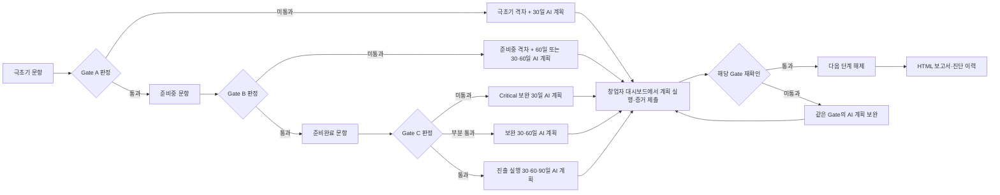

# 단계별 Gate 진단·AI GTM 계획 전환안

## 결정 요약

현재의 `55문항 전체 응답 → 한 번의 예비진단 → 30·60·90일 계획` 흐름을 `현재 단계 응답 → 즉시 Gate 판정 → 다음 단계 또는 AI 계획`으로 바꾼다.

- Gate 판정은 기존 결정론적 규칙이 담당한다. AI는 점수나 통과 여부를 바꾸지 않는다.
- 뒤 단계 문항은 앞 Gate를 통과하기 전에는 숨기고 잠근다.
- 첫 미통과 Gate에서 진단 세션을 종료하고, 지금 필요한 기간만 AI 계획에 허용한다.
- 통과한 앞 단계 응답과 현재 단계 격차를 모두 AI 문맥으로 제공한다.
- 승인된 계획은 독립 HTML 보고서로 내려받을 수 있게 한다.

## 현재 구현에서 확인한 제약

1. `components/assessment-form.tsx:95-159`는 단계별 화면 이동만 제공하며 최종 제출 전 55문항 전체 응답을 요구한다.
2. `components/assessment-form.tsx:403-420`은 사용자가 잠기지 않은 모든 단계 탭을 직접 열 수 있게 한다.
3. `app/api/assessments/route.ts:17-38`은 API 입력을 정확히 55개로 제한한다.
4. `lib/readiness.ts:48-80`은 제출되지 않은 뒤 단계도 0점으로 계산하므로 단계별 저장에 그대로 사용할 수 없다.
5. `lib/gtm-assistant.ts:91-134`와 `app/api/gtm-assistant/turn/route.ts:246-261`은 어느 Gate에서 멈췄는지와 무관하게 30·60·90일 전체를 만든다.
6. 계획 보고서를 HTML로 내보내는 경로는 아직 없다.

## 제안 Gate 정책

기존 통과 규칙은 유지한다.

- 통과: 해당 단계 긍정 배점 비율이 80% 이상이고 Critical blocker가 0건이다.
- 미통과: 80% 미만이거나 Critical blocker가 1건 이상이다.
- 준비완료의 부분 통과: 초기 운영값으로 60% 이상 80% 미만이고 Critical blocker가 0건인 경우를 제안한다.
- Critical blocker가 있으면 점수와 관계없이 부분 통과가 아니라 미통과다.

`부분 통과 60%`는 AI가 판단할 값이 아니라 제품 규칙 상수로 둔다. 베타 데이터가 쌓이면 상수만 조정한다.

## 단계별 전환과 계획 기간

| 현재 단계 판정 | 다음 화면 | AI에 허용할 기간 |
| --- | --- | --- |
| 극초기 미통과 | 극초기 판정·격차 화면 → AI 워크숍 | 30일만 |
| 극초기 통과 | 준비중 문항 해제 | 없음 |
| 준비중 미통과 + 극초기 90% 이상·P0 없음 | 준비중 판정·격차 화면 → AI 워크숍 | 60일만 |
| 준비중 미통과 + 극초기 80~89% 또는 미완료 P0 있음 | 준비중 판정·격차 화면 → AI 워크숍 | 30일 + 60일 |
| 준비중 통과 | 준비완료 문항 해제 | 없음 |
| 준비완료 미통과 또는 Critical blocker 있음 | 준비완료 판정·격차 화면 → AI 워크숍 | 30일만 |
| 준비완료 부분 통과 | 준비완료 판정·격차 화면 → AI 워크숍 | 30일 + 60일 |
| 준비완료 통과 | 진출 실행 계획 워크숍 | 30일 + 60일 + 90일 |

기간 선택은 서버의 결정론적 함수가 반환한다. 모델에는 `allowedHorizons`를 입력하고, 출력 검증 시 허용되지 않은 기간의 항목을 거부한다.

## 사용자 흐름과 화면 구성

### 화면 1 — 현재 단계 진단

- 좌측에는 전체 `0/55` 대신 `극초기 0/N`처럼 현재 단계 진행률을 먼저 보여준다.
- 단계 목록은 `완료 / 현재 / 잠김` 세 상태만 사용한다.
- 잠긴 단계는 클릭할 수 없고 `앞 단계를 통과하면 열립니다`를 표시한다.
- 하단 주 CTA는 마지막까지 공통으로 `Gate A 결과 확인`, `Gate B 결과 확인`, `Gate C 결과 확인`으로 표시한다.
- 이전에 통과한 단계는 답변 요약만 볼 수 있고 현재 진단 도중 수정하지 않는다.

### 화면 2 — Gate 판정

- 상단에 `통과` 또는 `이번에는 여기서 준비합니다`를 한 문장으로 표시한다.
- 점수, 통과 기준 80%, Critical blocker, 가장 먼저 보완할 최대 5개 항목을 보여준다.
- 미통과일 때 뒤 단계 미리보기나 0점 점수를 노출하지 않는다.
- 주 CTA는 `AI와 30일 계획 만들기`, `AI와 60일 계획 만들기`, `AI와 30·60일 계획 만들기`처럼 실제 허용 기간을 명시한다.
- 통과 시 주 CTA는 `준비중 진단 계속`, `준비완료 진단 계속`이다.

### 화면 3 — AI GTM 워크숍

- 좌측 고정 요약에 `판정 단계`, `Gate 사유`, `통과한 앞 단계`, `이번 계획 기간`을 표시한다.
- 기존 목표 국가·고객·자원·기한·제약 입력을 재사용한다.
- 제목의 고정 `30 · 60 · 90 DAY PLAN`을 실제 허용 기간에 맞게 바꾼다.
- 모델 질문은 한 번에 하나만 유지하고, 서버가 정한 기간 밖의 계획은 만들 수 없게 한다.
- 계획 승인 후 `GTM 여정에 반영`, `HTML 보고서 다운로드`, `재진단 시점 설정`을 제공한다.

### 화면 4 — 창업자 Gate 실행 대시보드

기존 `/dashboard`를 별도의 새 제품으로 만들지 않고 창업자 중심 실행 화면으로 확장한다. 데이터 소유 단위는 조직을 유지하되 로그인한 창업자에게 자신의 현재 Gate와 실행 현황을 우선 표시한다.

#### 상단 Gate 요약

- 현재 Gate, 통과 기준 80%, 현재 긍정 배점, Critical 근거 충족 수를 한 카드에 표시한다.
- 전체 55문항 점수 대신 현재까지 열린 질문만 분모로 사용한다.
- `다음 단계까지 보완 5문항 · 근거 2건`처럼 남은 조건을 한 문장으로 보여준다.

#### 질문별 진행표

현재까지 열린 모든 질문을 항목별로 묶고 다음 네 상태로 표시한다.

| 상태 | 판정 | 화면 표시 |
| --- | --- | --- |
| 충족 | 응답 3~4단계이며 근거가 있음 | 녹색 체크, 응답·근거 보기 |
| 근거 보완 | 응답 3~4단계이나 근거가 없음 | 민트색 알림, 근거 추가 CTA |
| 보완 필요 | 응답 1~2단계 | 주황색 P0/P1, 연결된 AI 계획 표시 |
| 잠김 | 앞 Gate 미통과 단계의 질문 | 회색 잠금, 문항 내용은 숨김 |

- 필터는 `전체 / 보완 필요 / 근거 보완 / 충족` 네 개만 제공한다.
- 각 질문 행에는 질문, 기존 응답 문구, 배점, Critical 여부, 근거 유무, 연결된 계획 항목·상태·기한을 표시한다.
- 계획 항목의 `question_id`를 그대로 사용해 별도 연결 테이블을 만들지 않는다.
- 질문을 클릭하면 원래 답변과 익명화된 근거, 완료 조건, 관련 계획을 한 패널에서 본다.

#### 실행 계획

- 승인된 계획의 완료율과 오늘 먼저 할 최대 3개 항목을 보여준다.
- 창업자는 대시보드에서 `진행 전 / 진행 중 / 막힘 / 완료` 상태를 변경할 수 있다.
- 계획 항목의 `완료 근거`는 제출 증거가 아니라 완료 판단 기준이다. 실제 Gate 증거는 재확인 답변에 첨부한다.
- 계획 완료만으로 Gate가 자동 통과되지 않는다. 서버 재판정을 반드시 거친다.

#### Gate 재확인 CTA

- `Gate A 다시 확인` 버튼은 항상 제공하되, 미완료 P0가 있으면 `아직 P0 2건이 남았습니다`를 함께 표시한다.
- 재확인을 시작하면 현재 Gate 질문만 나오고 직전 응답이 미리 채워진다.
- 사용자는 보완한 답변과 note/URL/PDF/PNG/JPG 근거를 제출한다.
- Critical 질문은 3~4단계 응답과 근거가 모두 있어야 blocker가 해제된다. 비Critical 질문은 3~4단계 응답으로 배점에 반영하고 근거가 없으면 `근거 보완` 상태로 남긴다.

### 화면 5 — Gate 재확인

- 경로는 `/assessment/[assessmentId]/recheck`로 분리해 일반 신규 진단과 혼동하지 않는다.
- 현재 Gate 질문만 표시하고 뒤 단계는 보여주지 않는다.
- 직전 응답과 근거는 읽을 수 있으며 사용자가 새 응답·근거를 제출한다.
- 제출 시 새 assessment를 만들어 이력을 보존하고 결정론적으로 Gate를 다시 판정한다.
- 통과하면 다음 단계 진단 CTA와 대시보드의 잠금 해제를 동시에 반영한다.
- 미통과하면 기존 계획을 덮어쓰지 않고 같은 Gate의 다음 AI 계획 버전을 만든다.

### 화면 6 — 계획 보고서

- Borderless 로고, 회사명, 진단일, 현재 Gate 판정과 근거를 표시한다.
- 통과한 단계 요약, 보완 항목, 기간별 계획, 책임자·기한·완료 근거, 출처, 전문가 확인 필요 항목을 포함한다.
- 다른 조직 데이터가 섞이지 않도록 로그인 사용자와 조직 소유권을 서버에서 확인한다.
- PDF 라이브러리는 추가하지 않는다. 서버가 `text/html`과 `Content-Disposition: attachment`로 독립 HTML 파일을 내려준다. 인쇄/PDF 저장은 브라우저 기능을 쓴다.

## 데이터·API 최소 변경안

### 진단 세션

한 단계마다 별도 assessment를 만들지 않고 한 진단 세션의 같은 `assessment_id`에 답변을 누적한다. 그래야 통과한 앞 단계 응답을 AI가 일관되게 사용할 수 있다.

- `assessments.completed_at`을 nullable로 바꾼다. 다음 Gate가 열려 있으면 `null`, 미통과로 중단되거나 Gate C가 끝나면 완료 시각을 기록한다.
- `assessments.previous_assessment_id` nullable FK 한 개만 추가해 최초 판정과 재확인 이력을 연결한다.
- 별도 workflow 테이블은 만들지 않는다. 현재 단계는 저장된 답변과 기존 Gate 계산으로 유도한다.
- `POST /api/assessments` 입력을 `{ assessmentId?, stageId, answers, offering }`으로 바꾸고, 해당 단계의 정확한 question id 집합만 허용한다.
- 첫 단계는 assessment를 생성하고, 다음 단계는 같은 assessment의 답변을 upsert한다.
- Gate를 통과해 다음 단계로 갈 때는 action item과 AI plan을 아직 만들지 않는다.
- 첫 미통과 또는 Gate C 종료 시에만 현재 단계의 action item을 교체 생성하고 assessment를 완료한다.
- 완료된 assessment는 수정하지 않는다. 실행 후 재진단은 `previous_assessment_id`로 연결된 새 assessment를 만들고 현재 Gate의 직전 응답을 복사해 사용자가 확인하도록 한다.
- 기존 `readiness_answers.evidence_kind/evidence_value`와 `evidence_files.answer_id`를 재사용한다. 계획 항목용 증거 테이블은 만들지 않는다.

### 판정 함수

- `calculateStageReadiness(stageId, answers)`를 추가해 한 단계만 판정한다.
- Critical 질문은 긍정 응답뿐 아니라 근거 note/URL/file이 있어야 blocker가 해제되도록 한다.
- `questionProgress(answer, stageUnlocked)`는 `satisfied / evidence_needed / improvement_needed / locked` 상태를 반환한다.
- 기존 `calculateReadiness`는 저장된 누적 답변을 순서대로 호출해 전체 결과를 조립하도록 단순화한다.
- `decidePlanHorizons(result)`는 위 표의 기간만 반환한다.
- 문항·배점·80% 통과·Critical blocker 규칙은 바꾸지 않는다.

### AI 입력과 검증

- AI 입력에 `completedStages`, `stoppedStage`, `gateDecision`, `allowedHorizons`, 누적 답변 요약을 추가한다.
- `buildDeterministicPlan(actions, allowedHorizons)`도 같은 기간 규칙을 사용한다.
- `validatePlanDraft(output, allowedHorizons)`에서 기간 이탈을 거부한다.
- AI 장애 시에도 동일한 기간의 결정론적 계획을 제공한다.

## 구현 순서

1. `lib/readiness.ts`, `lib/types.ts`, `lib/readiness.test.ts`
   - 단계 단위 판정, 부분 통과, 기간 결정 함수를 먼저 만들고 테스트로 규칙을 고정한다.
2. 새 Supabase migration, `app/api/assessments/route.ts`
   - 진행 중 assessment와 단계별 upsert를 지원한다.
3. `components/assessment-form.tsx`, `app/globals.css`, `lib/pending-assessment.ts`
   - 현재 단계만 표시하고 잠금·판정·다음 단계/AI 분기를 구현한다.
4. `lib/gtm-assistant.ts`, `app/api/gtm-assistant/turn/route.ts`, `components/gtm-assistant.tsx`
   - 허용 기간을 AI와 fallback 모두에 강제하고 화면 문구를 동적으로 바꾼다.
5. `app/dashboard/page.tsx`, 기존 계획 PATCH API, 새 Gate 재확인 route
   - 질문별 상태, 질문-계획 연결, 계획 상태 변경, 증거 첨부, 새 assessment 재판정을 연결한다.
6. `app/api/gtm-plans/[planId]/export/route.ts`, `components/gtm-assistant.tsx`
   - 조직 소유권을 확인한 독립 HTML 다운로드를 추가한다.
7. `app/journey/page.tsx`
   - 승인 계획과 Gate 재확인 결과를 여정에 연결한다.

## 수용 기준

1. 새 사용자는 극초기 문항만 볼 수 있고 준비중·준비완료 문항을 열 수 없다.
2. 극초기 미통과 시 준비중 문항 없이 30일 AI 계획 CTA가 나온다.
3. 극초기 통과 시 같은 진단 세션에서 준비중 문항이 열린다.
4. 준비중 미통과 시 극초기 완성도 규칙에 따라 `60` 또는 `30·60` 기간만 AI 계획에 나타난다.
5. 준비완료 결과는 통과·부분 통과·미통과를 구분하고 규칙에 맞는 기간만 생성한다.
6. AI와 fallback 어느 쪽도 `allowedHorizons` 밖의 항목을 저장할 수 없다.
7. 앞 단계의 응답과 근거가 뒤 단계 AI 계획 문맥에 포함된다.
8. 계획 승인 후 로그인 사용자는 자신의 조직 계획만 HTML 파일로 내려받을 수 있다.
9. 완료된 진단과 승인 계획은 재진단으로 덮어쓰지 않는다.
10. 기존 55문항, 배점 합계 100, 80% Gate, Critical blocker 규칙은 유지된다.
11. 대시보드는 열린 질문을 `충족 / 근거 보완 / 보완 필요`로 구분하고 잠긴 단계의 문항 내용은 노출하지 않는다.
12. 각 보완 질문에서 연결된 AI 계획 항목의 상태와 기한을 확인할 수 있다.
13. 계획 항목 완료만으로 다음 Gate가 열리지 않으며, 현재 Gate 질문 재응답과 서버 판정을 거쳐야 한다.
14. Critical 질문은 긍정 응답과 근거가 모두 있어야 통과한다.
15. Gate 재확인 통과 시 다음 단계가 해제되고, 미통과 시 같은 Gate의 새 계획 버전으로 이어진다.

## 검증

- 단위 테스트: Gate A/B/C 통과·미통과, Gate C 부분 통과, Critical blocker, 기간 결정, AI 기간 검증.
- API 테스트: 잘못된 stageId, 다른 단계 문항 혼입, 중복 답변, 다른 조직 assessment 수정, 완료 세션 재수정 차단.
- 브라우저 확인: 세 단계 잠금/해제, 질문 상태 필터, 질문-계획 연결, 근거 첨부, Gate 재확인 통과·미통과, 로그인 전 응답 복원, AI 질문/계획/fallback, 모바일 1열, 키보드 포커스.
- 내보내기 확인: 파일명, UTF-8 한국어, HTML 단독 열기, 조직 소유권 403/404, 브라우저 인쇄.
- 최종 확인: `npm test`, `npm run lint`, `npm run build`와 단계별 대표 화면 캡처.

## 위험과 완화

- 중간 저장 중 네트워크 실패: 단계 제출 버튼을 중복 비활성화하고 응답을 로컬에 유지한다.
- AI가 Gate를 확대 해석: Gate 판정과 기간은 서버 값만 사용하고 모델 출력은 검증한다.
- 과거 진단 훼손: 완료 assessment는 불변으로 두고 재진단은 새 행으로 만든다.
- 부분 통과 기준의 자의성: 60%는 초기 운영값으로 문서화하고 베타 전환 데이터로 조정한다.
- 보고서의 민감정보: 사용자 입력을 기존 방식으로 마스킹하고 조직 소유권을 확인하며 원본 계약서·연락처는 포함하지 않는다.
- 상태만 완료하고 증거를 내지 않는 우회: 계획 완료와 Gate 통과를 분리하고 Critical 근거를 서버에서 검증한다.

## 이번 설계에서 하지 않는 것

- AI가 Gate 점수나 통과 기준을 바꾸는 기능
- 별도 workflow 엔진 또는 상태 머신 패키지
- 새 UI 컴포넌트 라이브러리
- 서버 PDF 생성 라이브러리
- 통과하지 않은 다음 단계의 질문·점수 예측
