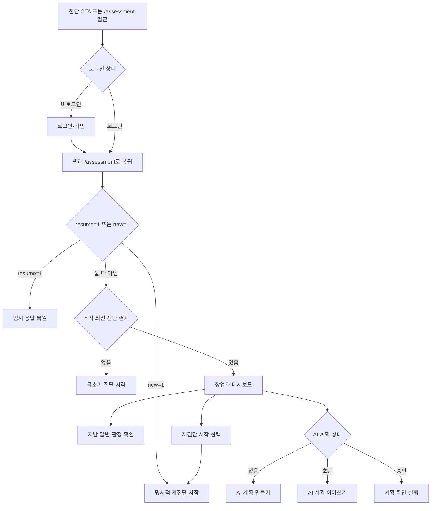

# 재로그인 창업자 대시보드 우선 진입 계획

- 작성일: 2026-08-10
- 상태: 구현 전 제안
- 범위: 로그인 후 진단·대시보드 진입 순서와 기존 결과·AI 계획 확인

## 1. 결론

재로그인 시점에 별도의 복잡한 상태 머신을 만들지 않는다. 모든 진단 진입이 통과하는 `/assessment` 서버 페이지에서 **최신 진단 존재 여부**만 확인한다.

- 최신 진단이 없는 신규 창업자: 기존처럼 극초기 질문을 시작한다.
- 최신 진단이 있는 재방문 창업자: `/dashboard`로 이동한다.
- 대시보드에서 사용자가 명시적으로 `재진단 시작`을 누른 경우에만 `/assessment?new=1`로 들어간다.
- 로그인 전 작성한 응답을 복원하는 `/assessment?resume=1`은 기존 동작을 유지한다.

대시보드는 이미 최신 단계 결과, 단계별 점수, 질문별 실제 답변과 의미, AI 계획 초안·승인 계획 항목을 조회하고 있다. 따라서 새 DB 테이블이나 새 대시보드를 만들 필요가 없다: `app/dashboard/page.tsx:34-40`, `app/dashboard/page.tsx:59-80`, `app/dashboard/page.tsx:159-280`.

## 2. 요구사항 요약

1. 사용자가 로그인하고 극초기 또는 준비중 판정을 받은 뒤 다시 로그인하면 진단 첫 문항이 아니라 대시보드를 먼저 본다.
2. 대시보드에서 지난 진단의 단계, 점수, 선결 조건, 질문별 답변과 그 의미를 확인한다.
3. AI GTM 계획이 없으면 계획 생성을, 초안이면 이어서 작성을, 승인된 계획이면 실행 내용을 확인할 수 있다.
4. 사용자가 과거 결과를 확인한 뒤 명시적으로 선택해야만 새 진단을 시작한다.
5. 로그인 전 임시 응답 복원과 운영자 대시보드 분기는 깨뜨리지 않는다.

## 3. 현재 흐름에서 확인한 원인

### 이미 올바른 부분

- 일반 비밀번호 로그인은 별도 `next`가 없으면 역할별 기본 경로로 이동하며, 스타트업 기본값은 `/dashboard`다: `app/signin/actions.ts:72-81`, `lib/auth.ts:1-3`.
- Google OAuth 콜백도 별도 목적지가 없으면 역할별 대시보드로 이동한다: `app/auth/callback/route.ts:101-110`.
- 대시보드는 조직의 최신 진단 한 건을 조회한다: `app/dashboard/page.tsx:30-40`.
- 최신 진단의 개별 답변을 복원해 질문, 실제 선택 문구, 답변 의미, 상태, 다음 행동을 표시한다: `app/dashboard/page.tsx:70-116`, `app/dashboard/page.tsx:159-255`.
- 해당 진단의 AI 계획 초안 또는 승인 계획과 계획 항목을 표시한다: `app/dashboard/page.tsx:65-80`, `app/dashboard/page.tsx:257-280`.

### 실제 문제

- 랜딩의 두 진단 CTA와 상단 `준비도 진단` 메뉴가 모두 `/assessment`로 직접 이동한다: `components/landing.tsx:34-38`, `components/landing.tsx:147-154`, `components/site-header.tsx:26-30`.
- `/assessment`는 현재 로그인 사용자에게 과거 진단이 있는지 확인하지 않고 항상 빈 `AssessmentForm`을 렌더링한다: `app/assessment/page.tsx:10-21`.
- `AssessmentForm`은 기본 상태를 빈 답변, 극초기, 잠금 단계 0으로 초기화한다: `components/assessment-form.tsx:44-56`.
- 과거 DB 진단을 불러오는 기능은 없고, `resume=1`일 때 브라우저 임시 저장 응답만 복원한다: `components/assessment-form.tsx:192-215`.

즉 로그인 자체의 기본 목적지는 이미 대시보드지만, 진단 CTA가 설정한 `/assessment` 목적지와 `/assessment`의 무조건 신규 시작 동작이 재방문 흐름을 우회한다.

## 4. 권장 전환 흐름

## 5. 화면별 제안

### 대시보드 상단

기존 최신 진단 카드와 단계 점수는 그대로 사용한다: `app/dashboard/page.tsx:123-153`.

- `진단 업데이트`를 `재진단 시작`으로 바꾼다.
- 링크를 `/assessment?new=1`로 변경한다.
- 과거 결과 확인과 새 진단 시작이 다른 행동임을 명확히 한다.

### 최근 진단 카드

현재 `응답 다시 보기`는 `/assessment`로 가지만 그 페이지는 과거 답변을 불러오지 않으므로 문구와 동작이 일치하지 않는다: `app/dashboard/page.tsx:147-152`.

- 문구: `지난 응답 보기`
- 링크: `/dashboard#answer-insights`
- 결과: 새 설문을 시작하지 않고 같은 페이지의 질문별 결과로 이동한다.

### 질문별 결과

현재 구현을 그대로 재사용한다.

- 답변한 단계 탭: `app/dashboard/page.tsx:177-188`
- 단계별 답변 분포 그래프: `app/dashboard/page.tsx:190-230`
- 질문·선택 답변·의미·다음 행동·증거: `app/dashboard/page.tsx:232-247`

추가 데이터나 AI 호출은 필요 없다.

### AI 계획 상태

현재 대시보드는 계획 유무에 따라 `AI 계획 만들기` 또는 `AI 계획 이어가기`를 이미 구분한다: `app/dashboard/page.tsx:257-265`.

여기에 작은 상태 문구만 명시한다.

- 계획 없음: `아직 계획이 없습니다.`
- `draft`: `AI와 작성 중인 계획이 있습니다.`
- `active`: `승인되어 실행 중인 계획이 있습니다.`

`active`이면 기존 계획 항목과 함께 `/journey`의 승인 계획 실행 화면도 제공한다. `/journey`는 조직의 최신 `active` 계획과 항목을 이미 조회한다: `app/journey/page.tsx:40-57`, `app/journey/page.tsx:68-88`.

## 6. 최소 구현 단계

### 1단계 — `/assessment`에 재방문 보호 분기 추가

수정: `app/assessment/page.tsx:4-21`

1. `searchParams`에 `new?: string`을 추가한다.
2. 로그인 사용자이고 `resume !== "1"`, `new !== "1"`이면 프로필의 `organization_id`를 조회한다.
3. 해당 조직의 최신 assessment ID 존재 여부만 조회한다.
4. 최신 진단이 있으면 `/dashboard`로 redirect한다.
5. 없으면 기존 `AssessmentForm`을 그대로 렌더링한다.

이 한 곳을 고치면 랜딩 CTA, 상단 메뉴, 직접 URL, 로그인 후 복귀가 모두 같은 규칙을 적용받는다. CTA마다 별도 조건을 넣지 않는다.

### 2단계 — 대시보드의 명시적 재진단 경로 정리

수정: `app/dashboard/page.tsx:123-151`

- `진단 업데이트` → `재진단 시작`, `/assessment?new=1`.
- `응답 다시 보기` → `지난 응답 보기`, `/dashboard#answer-insights`.
- 최신 진단이 없는 빈 상태의 `무료 준비도 진단`은 `/assessment`를 유지한다: `app/dashboard/page.tsx:43-53`.

### 3단계 — AI 계획 상태를 한눈에 표시

수정: `app/dashboard/page.tsx:257-280`

- 기존 `plan.status`를 한국어 상태 문구로 출력한다.
- `draft`는 `/assistant/{assessmentId}`의 `계획 이어가기`를 유지한다.
- `active`는 `/assistant/{assessmentId}`의 `계획 확인·수정`과 `/journey`의 `실행 계획 보기`를 제공한다.
- 계획이 없으면 기존 `AI 계획 만들기`를 유지한다.

DB 구조와 조회 범위는 변경하지 않는다. 계획 상태 값은 이미 `draft`, `active`, `superseded`, `completed`로 정의되어 있고 현재 화면은 열린 계획인 `draft`, `active`만 사용한다: `supabase/migrations/005_ai_gtm_assistant.sql:1-30`, `app/dashboard/page.tsx:65-69`.

### 4단계 — 회귀 테스트와 브라우저 검증

수정 후보: `app/assessment/page.test.tsx` 또는 현재 테스트 구성에 맞는 최소 서버 페이지 테스트, `middleware.test.ts`.

- 진단 없는 로그인 사용자: `/assessment`에서 설문을 본다.
- 진단 있는 로그인 사용자: `/assessment`에서 `/dashboard`로 이동한다.
- 진단 있는 사용자가 `/assessment?new=1`을 열면 새 설문을 본다.
- `/assessment?resume=1`은 임시 응답 복원 경로를 유지한다.
- 비로그인 사용자의 `/assessment` 접근은 middleware가 로그인으로 보내고 원 경로를 보존한다: `middleware.ts:39-50`.

## 7. 수용 기준

1. 최신 진단이 있는 스타트업 사용자가 일반 로그인하면 `/dashboard`에 도착한다.
2. 최신 진단이 있는 사용자가 랜딩의 진단 CTA, 상단 `준비도 진단`, 또는 `/assessment` 직접 URL을 사용해도 `/dashboard`에 도착한다.
3. 최신 진단이 없는 로그인 사용자는 `/assessment`에서 극초기 질문을 시작한다.
4. 대시보드에서 `재진단 시작`을 선택한 경우에만 `/assessment?new=1`에서 빈 새 진단이 열린다.
5. 로그인 전 임시 응답 복구용 `/assessment?resume=1`은 대시보드로 가로채지 않고 복원을 시도한다.
6. 대시보드에서 최신 진단 단계, 단계 점수, 선결 조건, 질문별 답변과 의미를 확인할 수 있다.
7. `지난 응답 보기`는 새 진단을 열지 않고 `#answer-insights`로 이동한다.
8. AI 계획이 없으면 생성 CTA, 초안이면 이어쓰기 CTA, 승인 계획이면 확인·실행 CTA가 표시된다.
9. 다른 조직의 assessment 존재 여부로 redirect가 결정되지 않는다.
10. 관리자 로그인 기본 경로 `/admin`과 onboarding 중간 경로는 현재 동작을 유지한다.

## 8. 위험과 완화

- **사용자가 새 진단을 시작할 길을 잃음**: 대시보드 상단에 `재진단 시작`을 항상 명시하고 `new=1`만 우회 허용한다.
- **임시 응답 복원이 과거 진단 때문에 차단됨**: `resume=1`을 최신 진단 검사보다 먼저 우선 처리한다.
- **다른 조직 데이터로 잘못 분기**: 로그인 사용자의 profile에서 얻은 `organization_id`로 assessment 조회를 제한한다.
- **재진단 링크 공유로 의도치 않은 빈 진단 노출**: `new=1`은 화면만 열며 제출 전에는 DB 행을 만들지 않는 현재 동작을 유지한다.
- **과거 계획이 있는데 없음으로 보임**: 이번 범위는 현재 실행 가능한 `draft`·`active` 계획을 기준으로 한다. 완료 계획 이력이 실제 운영 요구로 확인될 때만 별도 이력 화면을 추가한다.

## 9. 검증 절차

1. 단위/서버 페이지 테스트로 최신 진단 유무와 `new`, `resume` 분기를 확인한다.
2. `npm test`로 인증, middleware, 준비도 판정, AI 계획 회귀를 확인한다.
3. `npm run typecheck`로 server component의 `searchParams`와 Supabase 결과 타입을 확인한다.
4. `npm run build`로 redirect와 dynamic page 빌드를 확인한다.
5. 프로덕션과 동일한 환경에서 다음 두 계정으로 브라우저 스모크 테스트를 수행한다.
   - 진단 이력이 없는 신규 계정: 로그인 → 극초기 진단.
   - 극초기 또는 준비중 이력이 있는 재방문 계정: 로그인 → 대시보드 → 지난 응답 → AI 계획 상태.
6. 재방문 계정으로 `재진단 시작`을 선택해 새 진단이 명시적으로만 열리는지 확인한다.

## 10. 이번 범위에서 제외

- 새 workflow/state-machine 라이브러리
- 새 DB 테이블 또는 migration
- 과거 답변을 새 진단 폼에 자동 복사하는 기능
- 완료·대체된 AI 계획의 전체 버전 이력 화면
- 로그인할 때마다 단계나 AI 계획을 다시 계산하는 기능

이 항목들은 이번 요구를 충족하는 데 필요하지 않다. 현재 저장 데이터와 대시보드 표시 기능을 그대로 재사용한다.
