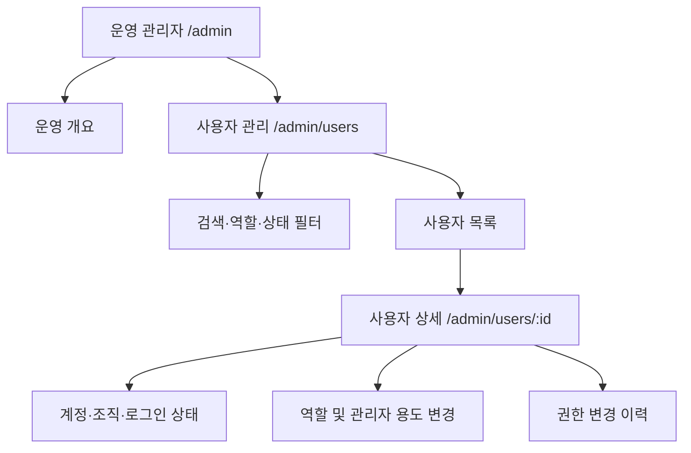

# 플랫폼 사용자·관리자 관리 설계

## 1. 문서 상태

- 상태: 로컬 구현 완료, DB 적용·커밋·배포 대기
- 작성일: 2026-08-16
- 범위: 운영 관리자용 사용자 조회, 관리자 권한 부여·회수, 관리자 계정 용도, 감사 이력
- 비범위: 두 인증 계정 병합, 팀원 초대, 일반 사용자의 조직 이동, MFA 자체 설정 화면
- 디자인 기준: 루트 `DESIGN.md`의 Borderless 토큰, `.panel`, `.button`, `.admin-table`, `.admin-filters`, `SiteHeader`를 그대로 사용한다.

## 2. 확인된 운영 상태

2026-08-16 운영 Supabase를 읽기 전용으로 확인한 결과다.

| 계정 | 표시 이름 | 현재 역할 | 조직 | 관리자 접근 |
| --- | --- | --- | --- | --- |
| `kyeon7@gmail.com` | Kevin (admin) | `admin` | GMAIL | 가능 |
| `kyeon@tansley.kr` | kyeon@tansley.kr | `startup` | Tansley Korea | 불가 |

- 활성 프로필은 5개이고 활성 관리자는 1개다.
- 두 계정은 같은 사람이 소유한다는 운영 사실이 있지만, 인증·프로필·조직은 서로 독립된 레코드다.
- 현재 `/admin`은 기업·진단·주문·전문가 승인을 관리하지만 전체 사용자 역할을 조회하거나 변경하는 화면은 없다.
- 일반 인증 사용자는 DB 컬럼 권한상 자신의 `role`과 `organization_id`를 수정할 수 없다. 이 제한은 유지한다.
- `applyProvider()`는 현재 서비스 역할로 신청자의 `role`을 무조건 `provider`로 변경한다. 관리자가 전문가 신청을 하면 관리자 권한이 사라질 수 있으므로 사용자 관리 기능 구현과 함께 차단해야 한다.

### 근거

- `app/admin/page.tsx:43-60` — 관리자 역할 검사와 운영 데이터 조회
- `app/admin/companies/[id]/page.tsx:20-33` — 기업 단위 사용자·진단·주문 조회
- `components/site-header.tsx:8-18` — `profile.role === "admin"`일 때만 운영 메뉴 표시
- `lib/auth.ts:3-5` — 관리자는 로그인 후 `/admin`으로 이동
- `supabase/migrations/001_initial.sql:20-26` — `profiles.role`이 현재 권한 원천
- `supabase/migrations/001_initial.sql:258-261` — DB의 `is_admin()` 판정
- `supabase/migrations/004_account_pii.sql:25-36` — 일반 사용자의 프로필 수정 컬럼 제한
- `app/provider/actions.ts:24-58` — 전문가 신청 시 역할 덮어쓰기 위험

## 3. 목표와 비목표

### 목표

1. 운영자가 모든 사용자의 계정 상태와 역할을 한 화면에서 확인한다.
2. 관리자 권한 변경은 서버와 DB에서 원자적으로 처리하고 반드시 감사 이력을 남긴다.
3. 마지막 활성 관리자 제거, 자가 권한 변경, 일반 사용자의 권한 상승을 막는다.
4. `kyeon7@gmail.com`은 주 관리자, `kyeon@tansley.kr`은 복구 관리자로 운영할 수 있다.
5. 데스크톱과 320px 모바일에서 같은 정보와 행동을 안전하게 제공한다.

### 비목표

- 두 이메일을 하나의 Supabase Auth 사용자로 병합하지 않는다.
- 같은 사람이라는 이유로 조직·진단·주문 이력을 자동 합치지 않는다.
- 이메일 주소를 관리자 allowlist 또는 권한 판정 수단으로 사용하지 않는다.
- 관리자 화면에서 비밀번호·OAuth 토큰·원시 `user_metadata`를 보여주지 않는다.
- 첫 버전에서 대량 권한 변경, CSV 내보내기, 사용자 대행 로그인 기능을 만들지 않는다.

## 4. 핵심 보안 결정

### 4.1 인증 계정은 독립적으로 유지한다

두 이메일은 같은 사람의 계정이어도 서로 다른 `auth.users.id`를 유지한다. 권한, 감사 이력, 로그인 기록도 계정별로 남긴다. 같은 사람이라는 사실은 권한을 공유하거나 이력을 병합하는 근거가 아니다.

### 4.2 기존 `profiles.role`을 권한 원천으로 유지한다

별도 권한 시스템을 추가하지 않고 현재 `startup | provider | admin` enum을 재사용한다. 기존 `is_admin()`, 헤더, 관리자 페이지, 로그인 후 이동 경로가 자동으로 같은 값을 사용한다.

### 4.3 역할 변경은 DB 함수 한 곳에서만 처리한다

클라이언트 또는 일반 PostgREST update로 `role`을 변경하지 않는다. 다음 보안 정의 함수(RPC)를 유일한 변경 경로로 둔다.

`manage_user_role(target_user_id, new_role, admin_purpose, reason)`

필수 규칙:

- 호출자의 `auth.uid()`가 활성 `admin`인지 확인
- 변경 대상이 존재하고 탈퇴 상태가 아닌지 확인
- 호출자 자신의 역할 변경 금지
- 역할이 실제로 바뀌는지 확인
- 마지막 활성 관리자를 다른 역할로 변경하지 못하도록 차단
- 관리자 계정은 다른 관리자가 일반 역할로 변경하기 전에는 직접 탈퇴하지 못하도록 차단
- 일반 계정 탈퇴는 서버 전용 DB 함수로 10분짜리 탈퇴 예약을 잡아 권한 승격과 경쟁하지 않게 한 뒤 외부 OAuth 연결을 해제하고 익명화를 완료
- 역할 변경 직전 트랜잭션 잠금으로 동시 변경 경쟁 방지
- 역할 변경과 감사 로그 insert를 한 트랜잭션에서 완료
- `admin`이 아니면 관리자 계정 용도는 항상 `null`
- 함수 실행 권한은 `authenticated`에만 부여하고 함수 내부에서 다시 관리자 여부 확인

### 4.4 관리자 계정 용도는 권한과 분리한다

`profiles.admin_account_purpose`는 다음 표시 목적만 가진다.

- `primary`: 주 관리자
- `recovery`: 복구 관리자
- `null`: 미지정 또는 관리자가 아님

이 값은 권한 판정에 사용하지 않는다. 동일 인물 계정 연결 테이블은 만들지 않는다.

### 4.5 관리자 계정과 전문가 계정을 섞지 않는다

관리자 계정은 전문가 신청을 할 수 없게 하거나, 최소한 `applyProvider()`가 `admin` 역할을 `provider`로 덮어쓰지 못하도록 한다. 권장 동작은 관리자에게 별도 전문가 계정을 사용하라는 안내를 보여주는 것이다.

## 5. 정보 구조



### 관리자 내비게이션

`/admin`과 하위 화면의 제목 아래에 작은 운영 서브내비게이션을 둔다.

- 운영 개요
- 사용자 관리

기존 전역 헤더 메뉴를 늘리지 않는다. 일반 사용자는 이 서브내비게이션을 볼 수 없다.

## 6. 화면 설계

### 6.1 사용자 목록 `/admin/users`

#### 화면 계층

1. Kicker: `USER OPERATIONS`
2. 제목: `사용자 관리`
3. 설명: `가입 상태와 역할을 확인하고 플랫폼 관리자 권한 변경 이력을 관리합니다.`
4. 요약 카드
5. 검색·필터
6. 사용자 목록

#### 요약 카드

기존 `.admin-metrics > .panel`을 재사용한다.

| 카드 | 값 |
| --- | --- |
| 활성 사용자 | `deleted_at is null`인 프로필 수 |
| 플랫폼 관리자 | 활성 `admin` 수 |
| 복구 관리자 | `admin_account_purpose = recovery` 수 |
| 탈퇴·비활성 | `deleted_at is not null`인 프로필 수 |

관리자가 1명뿐이면 카드 아래에 warning banner를 표시한다.

> 복구 관리자 계정이 없습니다. 주 관리자 접근을 잃으면 플랫폼 운영 화면에 접근할 수 없습니다.

#### 검색·필터

기존 `.admin-filters`를 재사용한다.

- 검색: 이메일·표시 이름·조직명
- 역할: 전체 / 창업자 / 전문가 / 관리자
- 계정 상태: 전체 / 활성 / 탈퇴
- 관리자 용도: 전체 / 주 관리자 / 복구 관리자 / 미지정
- 정렬: 최근 로그인 / 최근 가입 / 이름

#### 데스크톱 목록

| 열 | 표시 내용 |
| --- | --- |
| 사용자 | 표시 이름, 이메일 |
| 조직 | 조직명 |
| 역할 | 창업자 / 전문가 / 관리자 chip |
| 관리자 용도 | 주 관리자 / 복구 관리자 / `-` |
| 인증 | 이메일 / Google / Kakao 중 확인된 provider만 표시 |
| 상태 | 활성 / 이메일 미확인 / 탈퇴 |
| 최근 로그인 | locale 날짜 |
| 작업 | `상세 보기` 링크 |

전화번호, 암호화된 전화번호, 인증 metadata는 목록에서 조회하지 않는다.

#### 모바일 목록

720px 이하에서는 넓은 표를 억지로 축소하지 않고 사용자별 흰색 `.panel` 카드로 전환한다.

- 첫 줄: 이름 + 역할 chip
- 둘째 줄: 이메일
- 셋째 줄: 조직 · 상태
- 넷째 줄: 최근 로그인
- 마지막: 폭 100% `상세 보기`

터치 대상은 42px 이상, 목록 검색과 필터는 한 열로 배치한다.

### 6.2 사용자 상세 `/admin/users/[id]`

#### 상단 요약

- 이름, 이메일
- 역할 및 관리자 용도
- 조직
- 가입일, 최근 로그인, 이메일 확인 여부
- 인증 provider
- 활성·탈퇴 상태

#### 권한 변경 패널

위험 행동이므로 일반 프로필 정보와 별도 `.panel`로 분리한다.

- 새 역할 select
- 관리자 선택 시 관리자 용도 select 필수
- 변경 사유 textarea(10~500자)
- 확인 checkbox: `이 변경이 플랫폼 접근 권한에 영향을 준다는 것을 확인했습니다.`
- 버튼: `권한 변경`

다음 상태에서는 버튼을 비활성화하고 이유를 문장으로 설명한다.

- 자기 계정
- 탈퇴 계정
- 마지막 활성 관리자를 관리자에서 해제하려는 경우
- 현재 상태와 같은 값

성공 후에는 `권한을 변경하고 감사 이력에 기록했습니다.`를 표시한다. 실패 시 DB 오류 문구 대신 사용자가 해결할 행동을 안내한다.

#### 감사 이력

최근 순으로 다음을 표시한다.

- 변경 일시
- 실행 관리자
- 이전 역할 → 새 역할
- 관리자 용도 변경
- 사유

감사 이력은 수정·삭제 UI를 제공하지 않는다.

## 7. 데이터 설계

다음 순번의 migration은 `016_admin_user_management.sql`로 계획한다.

### profiles 추가 컬럼

```sql
alter table public.profiles
  add column admin_account_purpose text
  check (
    admin_account_purpose is null
    or (role = 'admin' and admin_account_purpose in ('primary', 'recovery'))
  );
```

`admin_account_purpose`의 role 연계는 직접 update가 아니라 RPC에서 강제한다. 기존 관리자에는 처음 `미지정`을 허용하며 사용자 관리 화면에서 정리한다. 이메일을 migration에 하드코딩하지 않는다.

### 감사 로그

```sql
create table public.admin_role_audit_log (
  id uuid primary key default gen_random_uuid(),
  actor_id uuid not null references public.profiles(id),
  subject_id uuid not null references public.profiles(id),
  previous_role public.user_role not null,
  new_role public.user_role not null,
  previous_admin_purpose text,
  new_admin_purpose text,
  reason text not null check (char_length(trim(reason)) between 10 and 500),
  created_at timestamptz not null default now()
);
```

- RLS 활성화
- 조회는 관리자만 허용
- 일반 `insert/update/delete` 권한은 제거
- insert는 `manage_user_role` 내부에서만 수행
- 감사 로그 update/delete는 서비스 역할을 포함한 운영 절차 외에는 제공하지 않음

### DB 함수 동시성

마지막 관리자 차단 검사는 count만 확인하면 동시 요청 두 개가 모두 통과할 수 있다. `manage_user_role` 시작 시 동일한 advisory transaction lock을 획득한 뒤 관리자 수를 확인하고 update와 audit insert를 실행한다.

## 8. 서버·코드 영향도

| 영역 | 현재 | 변경 대응 |
| --- | --- | --- |
| `app/admin/page.tsx` | 운영 개요만 제공 | 사용자 관리 서브내비게이션 링크 추가 |
| `app/admin/users/page.tsx` | 없음 | 관리자 guard, 요약·검색·필터·목록 신규 구현 |
| `app/admin/users/[id]/page.tsx` | 없음 | 상세, 권한 폼, 감사 로그 신규 구현 |
| `app/admin/actions.ts` | 전화번호 열람만 있음 | `changeUserRole` server action 추가, RPC 결과 처리 |
| `lib/supabase/server.ts` | 페이지마다 관리자 검사를 반복 | 필요 시 기존 검사 패턴을 재사용하고 과한 새 auth layer는 만들지 않음 |
| `components/site-header.tsx` | 역할이 admin이면 운영 버튼 표시 | 변경 불필요. 두 번째 계정 승격 즉시 적용 |
| `lib/auth.ts` | admin 로그인 후 `/admin` 이동 | 변경 불필요 |
| `app/provider/actions.ts` | 신청자를 무조건 provider로 변경 | admin 신청 차단 또는 admin 역할 보존 |
| `app/globals.css` | admin table·filter·panel·mobile metric 보유 | 기존 class 재사용, 모바일 사용자 카드와 역할 chip만 최소 추가 |
| `lib/i18n.ts` | 전역 관리자 메뉴 번역 보유 | 사용자 관리 고정 문구는 기존 admin 방식대로 KO/EN 동시 제공 |
| Supabase | role은 profiles, 변경 이력 없음 | purpose 컬럼, audit table, 원자 RPC 추가 |
| 운영 | 관리자 1명 | 두 번째 계정 승격, 주·복구 용도 지정, MFA 별도 점검 |

## 9. 조회 경계와 개인정보

- 서버 컴포넌트에서 `createSupabaseAdminClient()`로 `auth.users`와 `profiles`, `organizations`를 조회한다.
- 브라우저에는 화면에 필요한 필드만 전달한다.
- 목록에서 `phone_enc`, OAuth access token, raw identities, raw metadata를 조회하지 않는다.
- 인증 방식은 provider 이름만 정규화해 보여준다.
- 전화번호는 기존 기업 상세의 `PhoneReveal`과 `pii_access_log` 경계를 그대로 유지한다.
- 사용자 목록·상세는 `dynamic = "force-dynamic"`으로 두고 사용자별 HTML을 공개 캐시하지 않는다.
- 검색 query는 서버에서 길이 제한과 정규화를 적용한다.
- 존재하지 않는 사용자 ID는 `notFound()`, 비관리자는 `/dashboard`로 redirect한다.

## 10. 상호작용 상태

| 상태 | UI |
| --- | --- |
| Loading | 서버 렌더링을 우선하며 제출 중 버튼만 비활성·문구 변경 |
| Empty | `조건에 맞는 사용자가 없습니다.` + 필터 초기화 링크 |
| Error | `사용자 정보를 불러오지 못했습니다. 다시 시도해 주세요.` |
| Success | 역할 변경 내용과 감사 기록 완료를 한 문장으로 안내 |
| Last admin blocked | `마지막 활성 관리자는 해제할 수 없습니다. 먼저 다른 관리자를 지정해 주세요.` |
| Self change blocked | `현재 로그인한 계정의 권한은 다른 관리자가 변경해야 합니다.` |
| Deleted account | 조회만 허용하고 권한 폼 비활성 |
| Missing purpose | 관리자 목록에 `용도 미지정` warning chip 표시 |

## 11. 접근성·반응형 기준

- WCAG 2.2 AA 수준을 목표로 한다.
- 역할·상태는 색만으로 구분하지 않고 텍스트를 함께 표시한다.
- 모든 input에 label을 연결하고 오류는 해당 필드와 `aria-describedby`로 연결한다.
- 제출 결과는 `role="status"` 또는 `role="alert"`로 알린다.
- focus-visible 3px 공통 ring과 42px 터치 대상을 유지한다.
- 모바일 카드의 읽기 순서는 이름 → 이메일 → 조직 → 역할 → 상태 → 행동이다.
- 320px에서 가로 스크롤 없이 사용자 카드와 권한 폼을 사용할 수 있어야 한다.
- `prefers-reduced-motion`에서는 새 motion을 추가하지 않는다.

## 12. 구현 순서

### 1단계 — DB 안전장치

1. migration 016 작성
2. purpose 컬럼, audit table, RLS·grant, `manage_user_role` RPC 추가
3. 마지막 관리자·자가 변경·일반 사용자 호출·동시 변경 검증

### 2단계 — 읽기 전용 사용자 관리

1. `/admin/users` 목록과 필터
2. `/admin/users/[id]` 계정 상세와 감사 이력
3. `/admin` 서브내비게이션 연결
4. KO/EN, 320px·데스크톱 확인

### 3단계 — 권한 변경

1. server action에서 입력 검증
2. RPC 호출과 성공·오류 상태 표시
3. `applyProvider()`의 관리자 역할 덮어쓰기 차단
4. 역할 변경 후 헤더·로그인 redirect·RLS 접근 확인

### 4단계 — 운영 설정

1. `kyeon7@gmail.com`을 `admin / primary`로 지정
2. `kyeon@tansley.kr`을 `admin / recovery`로 지정
3. 두 계정으로 `/admin`과 `/admin/users` 접근 확인
4. 두 계정의 MFA·복구 수단은 Supabase 운영 화면에서 별도 확인
5. 감사 로그와 활성 관리자 수 확인

## 13. 테스트 계획

### 자동 테스트

- 일반 사용자가 관리자 RPC를 호출하면 거부
- 일반 사용자가 PostgREST로 role을 변경하면 거부
- 관리자가 다른 활성 사용자를 admin으로 지정 가능
- 관리자 역할에는 primary/recovery/미지정만 허용
- non-admin 역할에는 purpose가 남지 않음
- 마지막 활성 관리자 해제 거부
- 자기 역할 변경 거부
- 역할 변경과 감사 로그가 함께 성공하거나 함께 실패
- 관리자 전문가 신청이 admin 역할을 잃게 하지 않음
- admin 로그인 redirect와 헤더 운영 버튼 회귀 없음
- KO/EN 역할·상태 문구 parity

### 수동 검증

- 1440px·768px·320px 사용자 목록과 상세
- 키보드만으로 필터, 상세 이동, 권한 변경 가능
- 긴 이메일·긴 조직명이 카드나 표를 깨뜨리지 않음
- 변경 중 중복 제출 차단
- 성공·실패·마지막 관리자 경고를 스크린리더가 인식
- 운영 DB에서 두 관리자 레코드와 감사 로그 직접 확인

## 14. 로컬 구현 기록

- 사용자 목록·상세, 관리자 서브내비게이션, 권한 변경 폼과 감사 이력을 구현했다.
- 관리자 자가 변경, 마지막 활성 관리자 해제, 탈퇴 계정 변경을 차단했다.
- 전문가 신청과 역할 전환을 하나의 DB 트랜잭션으로 묶고 관리자 계정의 역할 덮어쓰기를 차단했다.
- 탈퇴 계정의 관리자·조직 접근을 끊고 관리자 계정의 직접 탈퇴를 차단했다.
- 탈퇴 예약과 역할 변경이 같은 DB 잠금을 사용해 OAuth 연결 해제 중 관리자 승격이 끼어들지 못하게 했다.
- migration `016_admin_user_management.sql`은 작성만 했으며 운영 DB에는 아직 적용하지 않았다.
- 사용자 지시에 따라 커밋·푸시·운영 배포와 실제 계정 승격은 보류한다.

## 15. 배포·롤백 영향

### 배포 순서

1. migration 016 적용
2. DB 함수와 grant를 읽기 전용으로 검증
3. 애플리케이션 배포
4. 주·복구 관리자 지정
5. 두 계정 로그인 smoke test

DB를 먼저 배포해도 기존 앱은 추가 컬럼과 테이블을 사용하지 않으므로 동작이 유지된다.

### 롤백

- 애플리케이션 롤백 시 기존 `/admin`과 `profiles.role` 판정은 계속 작동한다.
- migration 016 적용 뒤 앱을 롤백할 때도 `app/account/actions.ts`의 `close_profile` 호출과 `app/provider/actions.ts`의 `apply_for_provider` 호출은 유지한다. 이전 직접 update·insert 구현으로 되돌리면 관리자 탈퇴와 전문가 신청의 원자성·우회 차단이 깨진다.
- audit table과 purpose 컬럼은 데이터를 보존한 채 남긴다.
- `manage_user_role` 실행 권한만 회수하면 관리자 권한 변경을 즉시 중단할 수 있다. 앱 롤백 시에는 `begin_profile_closure` → `cancel_profile_closure` 또는 `close_profile`의 전체 호출 순서를 유지한다. `close_profile`과 `apply_for_provider`는 해당 앱 경로를 함께 중단하거나 DB 정책·권한을 이전 상태로 복원하지 않는 한 회수하지 않는다.
- 이미 변경된 역할은 자동 원복하지 않고 감사 로그를 기준으로 운영자가 결정한다.

## 16. 완료 기준

- [ ] 운영 화면에서 두 이메일의 역할과 계정 상태를 확인할 수 있다.
- [ ] `kyeon7@gmail.com`은 주 관리자, `kyeon@tansley.kr`은 복구 관리자로 표시된다.
- [ ] 두 계정은 독립된 인증·조직·활동 이력을 유지한다.
- [ ] 비관리자는 사용자 목록·상세·RPC에 접근하지 못한다.
- [ ] 사용자는 자신의 role을 직접 변경할 수 없다.
- [ ] 관리자 변경은 이유와 실행자를 포함해 감사 로그에 남는다.
- [ ] 마지막 활성 관리자를 제거할 수 없다.
- [ ] 관리자 계정이 전문가 신청으로 강등되지 않는다.
- [ ] 기존 운영 대시보드·기업 상세·전화번호 감사 경계에 회귀가 없다.
- [ ] KO/EN 및 320px 모바일을 포함한 접근성 검증을 통과한다.

## 17. 구현 전 남은 확인

- MFA 등록 여부는 현재 운영 DB 조회로 확인하지 않았다. 구현 전에 두 관리자 계정의 MFA 상태를 Supabase에서 확인한다.
- 복구 관리자 계정을 일상적으로 사용할지 비상시에만 사용할지 운영 정책을 확정한다. 권장값은 비상시 전용이다.
- `provider`와 `admin`을 동시에 가져야 하는 실제 운영 사례가 생기면 단일 role enum을 분리한다. 현재는 별도 계정을 사용하는 것이 가장 단순하다.
