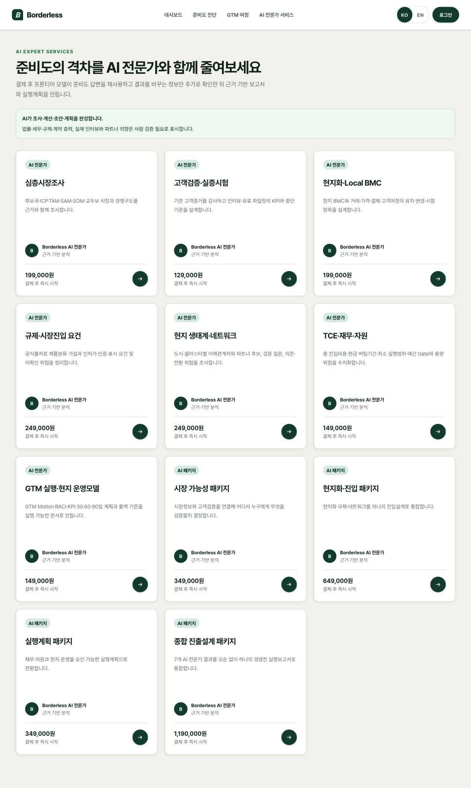

# AI 전문가 서비스 화면 개편 채택안

작성일: 2026-08-16
대상: `/services`, `/services/[id]`
상태: 구현 준비 완료. 이 문서의 **채택** 항목을 다음 코딩 작업의 기준으로 사용한다.

## 1. 검토 근거

- 제안 문서: `/Users/kyuhwangyeon/global-gtm-platform/docs/design/2026-08-16-ai-expert-services-spec.md`
- 한국어 문구 검토: `/Users/kyuhwangyeon/global-gtm-platform/docs/design/2026-08-16-services-page-korean-copy.md`
- 현재 운영 화면: [AI 전문가 서비스 목록](./audits/2026-08-16-services-current.png)
- 현재 코드: `app/services/page.tsx`, `app/services/[id]/page.tsx`, `components/service-card.tsx`, `lib/ai-agent-services.ts`, `lib/services.ts`, `app/globals.css`



## 2. 현재 화면 감사

| 단계 | 화면 | 상태 | 확인 결과 |
|---:|---|---|---|
| 1 | 서비스 목록 진입 | 보완 필요 | 7개 전문가와 4개 패키지가 한 목록에 섞여 있어 비교 기준이 약하다. |
| 2 | 카드 비교 | 보완 필요 | 모든 카드에 동일한 제공자 정보가 반복되고, 구매 판단에 필요한 결과물은 보이지 않는다. |
| 3 | 상세 확인 | 양호 | 결과물·진행 방식·필요정보·검증 경계·부가세 포함 총액은 이미 구조화되어 있다. 문구만 자연스럽게 다듬으면 된다. |
| 4 | 태블릿·모바일 | 보완 필요 | 코드상 900px에서 3열이 바로 1열로 바뀐다. 실제 320px 뷰포트 캡처는 브라우저 제어의 크기 변경이 적용되지 않아 이번 감사에서 확인하지 못했다. |

스크린샷으로 확인한 접근성 위험은 카드의 반복 정보로 핵심 차이가 늦게 드러나는 점이다. 키보드 순서, 초점 표시, 스크린리더 읽기 순서는 코드 구현 후 별도 검증한다.

## 3. 채택 결정

### 3.1 바로 채택

1. **한국어 문구 전면 교정**
   - 첨부 사양서 1.1~1.4의 제목·설명·결과물·필요정보·전문가 검증 문구를 적용한다.
   - `심층 시장조사`, `고객 검증·실증 시험`, `현지화 사업모델 설계`, `진입 비용·자금 계획`처럼 표준 띄어쓰기와 쉬운 표현을 사용한다.
   - `TCE`, `예산 Gate`, `근거 원장`, `현금 버팀기간`처럼 고객이 해석해야 하는 표현은 화면에서 제거한다.
   - `프론티어 모델` 표기 원칙은 유지한다.

2. **전문가와 패키지를 두 섹션으로 분리**
   - 전문가 7개: `필요한 항목만 골라 진행하세요`
   - 패키지 4개: `여러 항목을 묶어 한 번에 진행하세요`
   - 새 데이터나 API 없이 기존 `productKind`로 나눈다.

3. **목록 카드의 반복 제공자 줄을 결과물로 교체**
   - AI 카드에는 `deliverables` 상위 2개를 보여준다.
   - 제공자 정보는 목록 상단 안내와 상세 화면에 남긴다.
   - 상세 화면의 제공자 정보는 한 번만 나오므로 유지한다.

4. **반응형 그리드 단순화**
   - 고정 3열과 900px 1열 규칙을 `repeat(auto-fit, minmax(min(100%, 320px), 1fr))`로 교체한다.
   - 별도 자바스크립트나 새 컴포넌트 없이 CSS 한 규칙으로 3·2·1열을 처리한다.

5. **가격의 부가세 경계 명시**
   - AI 카드 가격 아래에 `부가세 별도`를 표시한다.
   - 실제 결제 총액 계산은 기존 상세 화면 로직을 그대로 사용한다.

6. **영문 제목 최소 동기화**
   - `ai-local-bmc`: `Local Business Model Design`
   - `ai-tce-finance`: `Entry Cost & Funding Plan`
   - id·tag·가격·문항 매핑은 변경하지 않는다.

### 3.2 조정하여 채택

1. **튜플은 객체로 바꾸되 문구 전용 파일은 만들지 않는다.**
   - `lib/ai-agent-services.ts`의 위치 기반 튜플은 명명된 `AiAgentDefinition` 객체로 바꾼다.
   - 현재 서비스가 11개이고 편집 주체가 개발팀뿐이므로 `lib/content/ai-services-copy.ts`는 추가하지 않는다. 파일 간 이동보다 한 파일의 명명된 객체가 더 단순하다.

2. **테스트는 핵심 계약만 직접 검증한다.**
   - 서비스 11개, 안정된 id, 가격, tag, 문항 소유권, 공개 모델명 금지, 대표 한국어 문구를 검증한다.
   - 같은 문구 사전을 import해 자기 자신과 비교하는 테스트는 만들지 않는다.

3. **태그 진입 흐름은 유지하되 새 필터 바는 첫 구현에서 제외한다.**
   - `/journey`와 GTM 어시스턴트가 이미 `/services?tag=...`로 맥락을 전달한다.
   - 태그가 있을 때 `이 액션에 맞는 AI 전문가`와 검색 결과 수를 보여주는 기존 흐름을 유지한다.
   - 11개를 두 섹션으로 나눈 뒤에도 탐색 문제가 남을 때만 범주 필터를 추가한다.

### 3.3 보류 또는 제외

1. **`/services`의 진단 기반 추천 띠는 보류한다.**
   - `/journey` 하단에서 이미 최신 진단 기반 추천을 제공한다.
   - 목록 페이지에서 인증·진단 조회를 다시 수행하면 같은 기능과 쿼리가 중복된다.

2. **패키지 카드의 포함 전문가·절감액 표시는 보류한다.**
   - 시장 가능성 패키지와 실행계획 패키지는 현재 낱개 합계보다 비싸다.
   - 가격 프리미엄의 근거와 통합 조정 범위를 확정하기 전에는 할인 또는 절감 인상을 주는 비교 정보를 노출하지 않는다.

3. **DB, CMS, i18n 라이브러리, 장바구니, 다중 선택은 추가하지 않는다.**
   - 이번 문제는 정보 구조와 문구 문제이며 현재 코드와 CSS로 해결할 수 있다.

## 4. 목표 화면 구조

```text
AI EXPERT SERVICES
진단에서 부족했던 부분을 AI 전문가가 채웁니다
설명 2문장

[AI 역할과 전문가 확인 경계 안내]

필요한 항목만 골라 진행하세요
[전문가 카드] [전문가 카드] [전문가 카드]
...

여러 항목을 묶어 한 번에 진행하세요
[패키지 카드] [패키지 카드] [패키지 카드]
...
```

AI 카드의 정보 순서는 다음으로 고정한다.

1. 유형
2. 제목
3. 한 문단 설명
4. 주요 결과물 2개
5. 공급가와 `부가세 별도`
6. 시작 시점과 상세 이동 버튼

## 5. 구현 영향도

| 파일 | 변경 |
|---|---|
| `lib/ai-agent-services.ts` | 튜플을 객체로 전환하고 확정 한국어 문구·필요정보·전문가 검증·일부 영문 제목 반영 |
| `app/services/page.tsx` | 페이지 문구 교정, 전문가/패키지 섹션 분리, 태그 진입 시 기존 결과 표시 유지 |
| `components/service-card.tsx` | AI 카드의 제공자 반복 영역을 결과물 2개로 교체, 부가세 별도 표시 |
| `app/services/[id]/page.tsx` | 공통 진행 방식·필요정보·전문가 검증 문구 정합성 확인. 구조 변경 없음 |
| `app/globals.css` | 자동 반응형 그리드, 섹션 간격, 결과물 목록 스타일 추가. 고정 3→1열 규칙 삭제 |
| `lib/ai-agent-services.test.ts` | 대표 문구와 카탈로그 계약 갱신 |
| `components/service-card.test.tsx` | 새 제목, 결과물 노출, 공개 모델명 금지, 부가세 표시 검증 |
| `docs/design/2026-08-16-ai-expert-frontier-model-copy.md` | 목록 제목 결정을 새 제목으로 갱신 |

변경하지 않는 계약:

- 서비스 id
- tags
- includedAgentIds
- 질문 소유권
- 가격 숫자
- 결제·주문·실행 API
- DB 스키마

## 6. 구현 순서

1. **회귀 테스트 먼저**
   - 새 목록 제목, 대표 서비스 문구, 결과물 2개, `부가세 별도` 기대값을 테스트에 추가한다.
2. **카탈로그 문구와 객체 구조 변경**
   - 11개 튜플을 `AiAgentDefinition` 객체로 전환하면서 확정 문구를 적용한다.
3. **목록 정보 구조 변경**
   - 전문가/패키지 배열을 나누고 두 섹션을 렌더링한다.
4. **카드와 CSS 변경**
   - 결과물 2개, 부가세 표기, auto-fit 그리드를 적용한다.
5. **상세·영문 정합성 확인**
   - 제목, 결과물, 필요정보, 전문가 검증이 목록과 상세에서 같은 의미인지 확인한다.
6. **검증**
   - 대상 테스트 → 전체 테스트 → typecheck → build → 1280/768/320px 시각 확인 순으로 진행한다.

## 7. 완료 기준

- 한국어 목록에 `예산 Gate`, `TCE`, `근거 원장`, `현금 버팀기간`, `현지화·Local BMC`가 없다.
- 전문가 7개와 패키지 4개가 서로 다른 제목 아래 표시된다.
- 모든 AI 카드에서 상세로 이동하기 전에 주요 결과물 2개를 확인할 수 있다.
- 모든 AI 카드 가격에 `부가세 별도`가 표시된다.
- 1280px 3열, 768px 2열, 320px 1열이며 가로 스크롤이 없다.
- 키보드로 카드 링크를 순서대로 이동할 수 있고 초점 표시가 보인다.
- 한국어·영문 상세 화면의 제목과 결과물이 목록과 일치한다.
- 공개 화면에 실제 모델 식별자가 노출되지 않는다.
- `npm test`, `npm run typecheck`, `npm run build`, `git diff --check`가 통과한다.

## 8. 남은 사업 결정

패키지의 포함 전문가와 가격 비교를 공개하려면 먼저 아래 두 패키지의 가격 프리미엄을 설명하거나 가격을 조정해야 한다.

- 시장 가능성 패키지: 349,000원, 낱개 합계 328,000원
- 실행계획 패키지: 349,000원, 낱개 합계 298,000원

이 결정은 이번 화면 개편을 막지 않는다. 첫 구현에서는 포함 내역·절감액을 노출하지 않는다.
