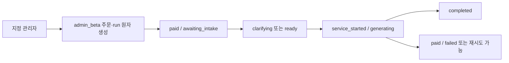

# 두 관리자 전용 AI 전문가 베타 실행 설계·구현계획

## 1. 문서 상태

- 작성일: 2026-08-17
- 상태: 코딩 준비 완료, 구현·DB 적용·커밋·배포 전
- 대상 계정: `kyeon7@gmail.com`, `kyeon@tansley.kr`
- 목표: 위 두 계정만 결제창 없이 실제 AI 전문가 서비스 전체 흐름을 시험한다.
- 핵심 원칙: 결제 게이트웨이만 우회하고, 준비도 연동·입력·파일·추가질문·모델 호출·웹 조사·보고서·사실 정정·비용 기록은 유료 운영과 같은 코드를 사용한다.
- 비범위: 일반 사용자의 무료 이용, 쿠폰·프로모션 시스템, 결제 기능 폐기, 별도 베타용 AI 실행기, 두 인증 계정의 병합.

## 2. 확인된 현재 상태

### 2.1 관리자 계정

기존 운영 확인 기록은 다음과 같다.

| 계정 | 현재 역할 | 관리자 용도 | 이번 기능에 필요한 조치 |
| --- | --- | --- | --- |
| `kyeon7@gmail.com` | `admin` | 주 관리자 예정 | 베타 허용 UUID 등록 |
| `kyeon@tansley.kr` | `startup` | 복구 관리자 예정 | 먼저 `admin`으로 승격한 뒤 베타 허용 UUID 등록 |

- 같은 사람이 소유해도 두 계정은 서로 다른 Supabase Auth 사용자·프로필·조직으로 유지한다.
- 이메일은 운영 식별자일 뿐 권한 판정에 사용하지 않는다.
- 관리자 역할은 계속 `profiles.role = 'admin'`을 권한 원천으로 사용한다.
- `profiles.admin_account_purpose = primary | recovery`는 표시와 운영 목적이며 베타 권한 원천으로 사용하지 않는다.

근거: `docs/design/2026-08-16-admin-user-management-design.md`, `supabase/migrations/016_admin_user_management.sql`.

### 2.2 현재 AI 전문가 주문·실행 흐름

1. 서비스 상세의 `CheckoutButton`이 `/api/orders`에 주문 생성을 요청한다.
2. AI 주문은 `pending` 상태와 실제 결제 금액으로 생성된다.
3. 클라이언트가 PortOne 결제창을 연다.
4. PortOne webhook이 결제를 검증하고 `reconcile_ai_payment`를 호출한다.
5. 결제 완료 시 주문을 `paid`로 바꾸고 `ai_agent_runs`를 만든다.
6. 주문 상세에서 사용자가 입력·파일·추가질문을 완료한다.
7. `reserve_ai_agent_generation`이 실행을 예약하고 동일한 프론티어 모델·웹 조사·검증·보고서 경로를 실행한다.
8. 성공·실패 RPC가 주문 상태와 사용량·비용을 기록한다.

관련 경계:

- `app/api/orders/route.ts` — 현재 `startup`만 AI 주문 가능, 정상 금액 주문 생성
- `components/checkout-button.tsx` — 주문 후 항상 PortOne 결제 시도
- `app/api/portone/webhook/route.ts` — AI 결제 검증 및 실행 레코드 생성
- `app/api/ai-agent-runs/[orderId]/route.ts` — `paid | service_started | completed` 주문만 실제 AI 실행
- `supabase/migrations/010_paid_ai_expert_services.sql` — 결제·예약·완료·실패 상태 전이
- `supabase/migrations/011_paid_ai_expert_contract.sql` — 양수 금액·VAT·직접 주문 DML 차단
- `supabase/migrations/013_ai_agent_readiness_snapshot.sql` — 실행 시 준비도 스냅샷 고정
- `lib/ai-agent-report.ts` — 모델·도구·결제·지원 비용 추정

### 2.3 현재 결론

현재는 관리자 무결제 실행이 구현되어 있지 않다. 개발 모드의 `demo` 응답은 결제창을 열지 않을 뿐 주문·실행 상태를 완성하지 않으므로 실전 AI 전문가 서비스 검증에 사용할 수 없다.

## 3. 설계 대안 비교

| 대안 | 장점 | 문제 | 결정 |
| --- | --- | --- | --- |
| 정상 가격 주문을 가짜 `paid`로 생성 | 코드 변경이 작아 보임 | 매출·결제수수료·환불·전환율을 오염시키고 결제 사실을 허위 기록 | 제외 |
| 새 `access_granted` 주문 상태 추가 | 의미가 명확함 | 모든 상태 전이·UI·RPC·테스트를 넓게 바꾸고 기존 운영 경로와 갈라짐 | 제외 |
| 별도 베타 실행 테이블·API 생성 | 결제와 분리됨 | 실제 유료 경로를 검증하지 못하고 코드가 이중화됨 | 제외 |
| 기존 주문에 `billing_mode`만 추가 | 실제 실행 경로 재사용, 비용·매출 분리, 롤백 단순 | 화면에서 원시 `paid` 의미를 숨겨야 함 | **채택** |

### 결정

`orders.billing_mode`를 `paid | admin_beta`로 추가한다. `admin_beta` 주문은 청구 금액이 0원이지만 실행 권한 상태는 기존 `paid`를 재사용한다. 운영 화면과 사용자 화면은 `billing_mode`를 함께 보고 `관리자 베타`로 표시한다.

이 결정은 상태 의미의 완벽한 순수성보다 다음을 우선한다.

- 실제 유료 실행 코드를 그대로 검증
- 최소 변경과 빠른 기능 차단
- 매출·결제·환불 데이터의 사실성 유지
- 별도 베타 실행기 방지

## 4. 권한과 보안 설계

### 4.1 정확히 두 계정만 허용

서버 전용 환경변수를 사용한다.

```text
ADMIN_AI_BETA_ACCESS_ENABLED=true
ADMIN_AI_BETA_USER_IDS=<auth-user-uuid-1>,<auth-user-uuid-2>
```

검증 규칙:

1. 기능 플래그가 정확히 `true`여야 한다.
2. UUID 목록은 정확히 2개여야 한다.
3. 두 UUID는 서로 달라야 한다.
4. 각 값은 유효한 UUID 형식이어야 한다.
5. 현재 로그인 사용자의 UUID가 목록에 있어야 한다.
6. 해당 프로필이 `deleted_at is null`이고 현재도 `role = 'admin'`이어야 한다.
7. 하나라도 맞지 않으면 관리자 베타 경로는 닫고 정상 유료 경로만 유지한다.

이메일을 코드·DB 함수·클라이언트에 하드코딩하지 않는다. UUID 목록은 클라이언트로 보내지 않으며 저장소에 커밋하지 않는다.

### 4.2 신뢰 경계

- 클라이언트는 `billing_mode`, 관리자 여부, 무료 여부를 요청 본문으로 보내지 않는다.
- `/api/orders`가 인증 사용자와 서버 환경을 기준으로 결제 모드를 결정한다.
- DB 생성 RPC도 호출자의 활성 관리자 역할을 다시 확인한다.
- 새 RPC는 `service_role`만 실행할 수 있다.
- 기존의 `authenticated` 직접 `orders` insert/update/delete 차단을 유지한다.
- PortOne webhook은 `billing_mode != 'paid'` 주문을 조정하지 않는다.
- 환불 API는 `admin_beta` 주문에 대해 PortOne을 호출하지 않고 `환불 대상 아님`을 반환한다.
- 로그에 UUID allowlist, 입력 원문, 첨부파일 내용, 모델 보고서를 남기지 않는다.

### 4.3 관리자 관리 기능 선행조건

현재 로컬에 준비된 사용자 관리 기능을 먼저 검증·배포해 `kyeon@tansley.kr`을 복구 관리자로 승격한다. 이후 두 활성 관리자 UUID를 읽기 전용으로 확인해 Vercel 환경변수에 등록한다.

## 5. DB와 상태 전이

### 5.1 최소 스키마 변경

다음 migration 하나를 추가한다.

```sql
alter table public.orders
  add column billing_mode text not null default 'paid';
```

허용값:

- `paid`: 정상 결제 주문
- `admin_beta`: 지정 관리자 무결제 테스트

금액 불변식:

| 모드 | `amount_krw` | `supply_amount_krw` | `vat_amount_krw` | `platform_fee_krw` | `provider_amount_krw` |
| --- | ---: | ---: | ---: | ---: | ---: |
| `paid` | 기존처럼 양수 | 양수 | 0 이상 | 기존 계산 | 기존 계산 |
| `admin_beta` | 0 | 0 | 0 | 0 | 0 |

구현 전에 운영 DB에서 기존 check constraint 이름을 조회한 뒤, 011의 금액 제약을 expand 방식으로 교체한다. 이름을 추정해 무조건 drop하지 않는다.

### 5.2 원자적 베타 주문 생성

서비스 역할 전용 RPC `create_admin_beta_ai_order`가 다음을 한 트랜잭션에서 수행한다.

1. 대상 사용자가 활성 `admin`인지 재검증
2. `billing_mode = 'admin_beta'`, 금액 0, `status = 'paid'`인 AI 주문 insert
3. 결제 당시와 동일한 `service_snapshot`, `readiness`, `terms_snapshot` 저장
4. `ai_agent_runs`를 `awaiting_intake` 상태로 insert
5. 어느 한 insert라도 실패하면 전부 rollback

`service_snapshot`에는 실제 상품가를 `listPriceKrw`로 보존한다. `terms_snapshot`에는 `paymentRequired: false`, `refundEligible: false`, 관리자 베타 실행임을 기록한다.

별도 감사 테이블은 만들지 않는다. `orders.billing_mode`, `buyer_id`, `created_at`, `service_snapshot`이 필요한 추적성을 제공한다.

### 5.3 실행 상태



- `paid`는 내부 실행 권한 상태로만 재사용한다.
- UI에서는 베타 주문에 `결제 완료`라고 표시하지 않는다.
- 생성 횟수, 추가질문 2회, 사실 정정 1회, 파일 제한, 출처 검증은 정상 유료 주문과 동일하다.
- 플래그를 꺼도 이미 만든 베타 주문은 소유자가 계속 열고 실행할 수 있어야 한다. 플래그는 새 베타 주문 생성만 막는다.

## 6. 비용과 지표

### 6.1 비용 기록

실제 AI 비용은 관리자 부담이므로 다음을 유료 주문과 동일하게 기록한다.

- 입력·캐시·출력 토큰
- 웹 검색 호출 수
- 모델 비용 USD
- 도구 비용 USD
- 지원·저장 추정비용 KRW
- 총 변동비 KRW

`estimateAiVariableCosts`는 `billingMode`를 받아 `admin_beta`의 결제수수료만 0원으로 계산한다. 나머지 비용 계산은 동일하다.

### 6.2 운영 지표 분리

다음 지표에서 `admin_beta`를 제외한다.

- 매출
- 결제 전환율
- 진단 후 구매 전환율
- 결제 후 미시작 업무 목록
- 정산
- 환불률

관리자 화면에는 별도 베타 지표만 추가한다.

- 관리자 베타 주문 수
- 완료·실패 수
- 실제 추정 변동비 합계
- 계정별 실행 수와 최근 실행일

기존 일반 주문 지표와 합산하지 않는다.

## 7. UI/UX 설계

### 7.1 서비스 상세

기존 `.panel`, `.purchase-panel`, `.notice-banner`, `.button`, `.checkout-box`를 재사용한다. 새 디자인 시스템이나 컴포넌트 라이브러리를 추가하지 않는다.

지정 관리자에게만 구매 패널 상단에 다음 안내를 표시한다.

> **관리자 베타 테스트**  
> 결제 없이 실제 AI 실행 환경을 테스트합니다. 모델·검색·파일·추가질문·보고서·비용 기록은 운영과 동일합니다.

가격 표현:

- 서비스 기준가: 기존 상품가
- 관리자 테스트 청구액: `0원`
- 보조 문구: `결제창은 열리지 않으며 실제 AI 사용 비용은 운영 지표에 기록됩니다.`

동의 문구:

> AI 서비스 범위와 첨부파일의 OpenAI 비공개 처리에 동의합니다. 관리자 베타 테스트는 결제·환불 대상이 아닙니다.

CTA:

- 한국어: `관리자 베타 테스트 시작`
- 영어: `Start admin beta test`
- 로딩: `테스트 환경 준비 중…`

버튼은 기존 primary/full 규격, 최소 42px 터치 영역, 기존 focus ring을 유지한다.

### 7.2 주문 상세

- badge: `관리자 베타`
- 금액: `청구액 0원`
- 보조 정보: `서비스 기준가 199,000원` 형식
- 환불 행: `결제 없음 · 환불 대상 아님`
- `OrderActions`의 취소·환불 버튼은 숨긴다.
- 상태 표시는 원시 DB 상태 대신 run과 조합한다.

| DB 상태 | 화면 문구 |
| --- | --- |
| `paid` + intake 전 | 테스트 사용 가능 |
| `paid` + 실패 | 재시도 가능 |
| `service_started` | 보고서 생성 중 |
| `completed` | 테스트 완료 |

AI workspace 자체는 유료 주문과 완전히 동일하게 렌더링한다.

### 7.3 비대상 사용자

- 일반 창업자: 현재 유료 결제 화면과 문구 유지
- 허용목록에 없는 관리자: 기존 정책상 구매 불가 안내 유지
- 기능 플래그 OFF: 모든 관리자 베타 표시와 우회 동작 제거, 유료 경로 변화 없음

### 7.4 접근성·반응형

- 320px에서 가격·badge·CTA가 가로로 넘치지 않는다.
- 상태는 색만으로 전달하지 않고 텍스트로 표시한다.
- 동의 checkbox에 명시적 label을 유지한다.
- 로딩·오류 문구는 기존 `role=status` 경로를 유지한다.
- 키보드만으로 동의와 CTA 실행이 가능해야 한다.

## 8. 코드 영향도와 최소 변경 파일

### 새 파일

- `supabase/migrations/017_admin_ai_expert_beta_access.sql`
- `supabase/migrations/017_admin_ai_expert_beta_access.test.ts`
- `lib/admin-ai-beta.ts`
- `lib/admin-ai-beta.test.ts`

### 수정 파일

- `app/services/[id]/page.tsx` — 서버에서 현재 사용자 베타 자격 판정, 가격·안내 전달
- `components/checkout-button.tsx` — API 응답의 `requiresPayment`가 false이면 PortOne 없이 주문 상세로 이동
- `app/api/orders/route.ts` — 두 관리자 전용 베타 주문 생성 분기, 정상 유료 분기 보존
- `app/orders/[id]/page.tsx` — `billing_mode` 조회, 베타 badge·금액·상태·환불 UI
- `app/api/ai-agent-runs/[orderId]/route.ts` — `billing_mode` 조회, 비용 계산에 전달
- `app/api/orders/[id]/refund/route.ts` — 베타 주문 gateway 호출 차단
- `app/api/portone/webhook/route.ts` — 베타 주문 결제 조정 차단
- `lib/ai-agent-report.ts` — 결제수수료 계산을 billing mode에 따라 분리
- `lib/admin-metrics.ts` — 전환·업무 목록에서 베타 제외, 별도 비용 지표
- `app/admin/page.tsx` — 관리자 베타 비용 카드·목록 표시
- `app/admin/companies/[id]/page.tsx` — 베타 주문 badge와 0원 표시
- `app/globals.css` — 기존 토큰을 이용한 작은 beta notice/badge spacing만 추가

새 API route, 새 프론트엔드 상태관리 도구, 새 결제 추상화, 새 권한 테이블은 만들지 않는다.

## 9. API 계약

`POST /api/orders` 요청 형식은 유지한다. 서버가 자격을 판정한다.

정상 결제 응답:

```json
{
  "orderId": "uuid",
  "paymentId": "gtm-uuid",
  "amount": 218900,
  "requiresPayment": true
}
```

관리자 베타 응답:

```json
{
  "orderId": "uuid",
  "amount": 0,
  "requiresPayment": false
}
```

- 관리자 베타 응답에는 외부 결제에 사용할 payment ID를 클라이언트 계약으로 제공하지 않는다.
- 클라이언트는 `requiresPayment === false`이면 즉시 `/orders/{orderId}`로 이동한다.
- `billingMode`를 클라이언트 요청으로 받지 않는다.

## 10. 테스트 설계

### 10.1 단위 테스트

1. UUID 환경변수 파서
   - 정확히 2개의 서로 다른 UUID만 허용
   - 0·1·3개, 중복, 잘못된 UUID, 공백값은 fail closed
2. 관리자 베타 자격
   - flag ON + 허용 UUID + 활성 admin만 true
   - 탈퇴 admin, startup, 제3 admin, flag OFF는 false
3. 비용
   - 유료 주문은 기존 3.3% 결제수수료 유지
   - 관리자 베타는 결제수수료 0, 모델·도구·지원비 유지
4. 운영 지표
   - 관리자 베타는 매출·구매 전환·결제 미시작 목록에서 제외
   - 베타 비용 합계에는 포함
5. 주문 표시
   - beta 상태별 한국어·영어 문구와 환불 불가 표시

### 10.2 API 테스트

1. 허용된 두 관리자 각각 AI 베타 주문 생성 성공
2. 제3 관리자·startup·provider는 베타 분기 진입 불가
3. 클라이언트가 가짜 무료 필드를 보내도 무시
4. flag OFF에서 기존 유료 응답 유지
5. 약관 미동의·잘못된 상품·프로필 오류는 기존처럼 실패
6. 동일 idempotency key 재요청은 주문을 중복 생성하지 않음
7. 베타 주문 응답에 `requiresPayment=false`, 금액 0
8. 정상 주문 응답에 `requiresPayment=true`, 기존 금액
9. 환불 API가 beta 주문에서 PortOne fetch 전에 종료
10. webhook이 beta 주문 상태를 변경하지 않음

### 10.3 DB 통합 테스트

1. RPC가 주문과 run을 원자적으로 생성
2. run insert 실패 시 주문도 남지 않음
3. 일반 인증 사용자의 직접 주문 DML 차단 유지
4. `paid` 모드는 0원 불가, `admin_beta`는 모든 금융 필드가 정확히 0이어야 함
5. beta 주문도 reserve→complete/fail 상태 전이가 정상 동작
6. beta 완료·실패에도 토큰·웹검색·비용 데이터 저장
7. beta 주문에는 payment event와 settlement가 생성되지 않음

### 10.4 E2E·UI 테스트

두 관리자 계정 각각 다음을 수행한다.

1. AI 전문가 상세 진입
2. 관리자 베타 안내와 청구액 0원 확인
3. 동의 후 PortOne 창 없이 주문 상세 이동
4. 준비도 스냅샷 확인
5. 입력·모름·파일 업로드·추가질문 수행
6. 실제 모델·웹 조사 실행
7. 보고서 출처·가정·문항 추적 확인
8. 사실 정정 1회 실행
9. 창을 닫고 다시 열어 결과 유지 확인
10. 운영 화면에서 비용과 상태 확인

대조군:

- 제3 관리자 또는 일반 계정은 관리자 베타 UI를 보지 못한다.
- 정상 창업자 결제는 PortOne 경로를 그대로 사용한다.
- 320px 모바일과 데스크톱에서 overflow·focus·상태 문구를 확인한다.

### 10.5 검증 명령

```bash
npm test -- lib/admin-ai-beta.test.ts lib/ai-agent-report.test.ts lib/admin-metrics.test.ts
npm test -- app/api/ai-agent-runs/[orderId]/route.test.ts
npm test
npm run typecheck
npm run build
git diff --check
```

## 11. 수용 기준

- 정확히 두 UUID 계정만 결제 없이 새 AI 전문가 주문을 만들 수 있다.
- 두 계정 모두 현재 활성 `admin`이 아니면 무료 실행할 수 없다.
- 결제창과 PortOne API는 관리자 베타 흐름에서 호출되지 않는다.
- 관리자 베타 주문의 모든 금융 필드는 0이고 매출·정산·환불 지표에 들어가지 않는다.
- 모델·웹 조사·첨부파일·추가질문·보고서·정정·출처 보안 검증은 유료 주문과 동일하다.
- 모델·도구·저장 비용은 실제 값으로 기록되고 관리자 화면에서 별도 확인된다.
- 기능 플래그 OFF 시 신규 베타 주문만 중단되며 기존 유료 흐름은 변하지 않는다.
- 기존 베타 주문은 플래그 OFF 후에도 소유자가 열고 완료할 수 있다.
- 일반 사용자 UI와 API 응답에는 관리자 UUID·내부 allowlist가 노출되지 않는다.
- 관련 단위·API·DB·E2E 테스트, typecheck, build가 통과한다.

## 12. 배포 순서와 롤백

### 배포

1. 현재 사용자 관리 로컬 변경을 검증하고 migration 016 및 앱을 배포한다.
2. `kyeon@tansley.kr`을 `recovery admin`으로 승격한다.
3. 두 활성 관리자 UUID를 운영 DB에서 읽기 전용으로 확인한다.
4. migration 017을 적용한다. 기능 플래그는 OFF로 유지한다.
5. 애플리케이션 코드를 배포한다.
6. Vercel에 정확한 두 UUID와 `ADMIN_AI_BETA_ACCESS_ENABLED=true`를 설정한다.
7. 두 계정으로 smoke test를 완료한다.
8. 관리자 베타 비용이 매출과 분리되는지 운영 화면에서 확인한다.

### 롤백

1. `ADMIN_AI_BETA_ACCESS_ENABLED=false`로 신규 베타 주문을 즉시 중단한다.
2. 정상 결제 경로는 계속 운영한다.
3. 이미 생성된 beta 주문은 읽기·실행을 허용해 작업 손실을 막는다.
4. 데이터 보존 기간 동안 column·constraint를 즉시 제거하지 않는다.

## 13. 아키텍처 자체 검토

### 가장 강한 반론

`paid` 상태를 무결제 주문에 사용하는 것은 상태 이름과 실제 결제가 어긋난다. 새 `access_granted` 상태가 더 정직해 보인다.

### 검토 결과

이번 상태의 목적은 결제 성공 자체가 아니라 AI 실행 자격이다. 결제 사실과 금액은 `billing_mode`와 0원 금융 필드가 권위 있게 표현하며, UI는 원시 상태를 노출하지 않는다. 새 상태를 추가하면 reserve·complete·fail·refund·order page·관리 지표·테스트 전체가 갈라져 실제 유료 경로 검증이라는 목표를 약화한다.

### 최종 판단

첫 베타에서는 `billing_mode = admin_beta` + 기존 실행 상태 재사용이 가장 작은 안전한 설계다. 향후 무료 체험, 쿠폰, 파트너 크레딧 등 결제 외 entitlement가 세 종류 이상 생길 때만 별도 entitlement 상태 모델을 도입한다.

## 14. 사전 실패 시나리오

| 실패 | 예방·탐지 |
| --- | --- |
| 제3 관리자가 무료 실행 | 정확히 두 UUID + 활성 admin 이중 검증, fail closed 테스트 |
| 베타 주문이 매출로 집계 | `billing_mode` 필터, 0원 DB constraint, 지표 회귀 테스트 |
| PortOne에 가짜 beta payment 요청 | 클라이언트 `requiresPayment=false`, webhook·refund beta 차단 |
| 실제 AI 비용이 기록되지 않음 | 유료와 동일한 run 완료/실패 RPC, beta 비용 합계 테스트 |
| 플래그 OFF 후 진행 중 보고서 유실 | 플래그는 생성 route만 제한, 기존 주문 실행은 billing_mode 기반 허용 |
| 두 번째 계정이 startup 상태로 남음 | 사용자 관리 선행 배포와 role 검증을 rollout gate로 지정 |
| 중복 클릭으로 무료 주문 다중 생성 | 서버 idempotency key와 버튼 loading/disabled 회귀 테스트 |

## 15. 코딩 시작 순서

1. `lib/admin-ai-beta.ts`의 환경변수 파서·자격 판정을 테스트 먼저 작성한다.
2. migration 017과 SQL 테스트로 `billing_mode`, 금액 제약, 원자 생성 RPC를 고정한다.
3. `/api/orders`에 서버 결정형 베타 분기를 추가하고 정상 결제 회귀 테스트를 통과시킨다.
4. `CheckoutButton`이 `requiresPayment=false`를 처리하도록 최소 수정한다.
5. 주문 상세·환불·webhook에 beta 경계를 추가한다.
6. 비용 계산과 관리자 지표를 분리한다.
7. 모바일·키보드·상태 문구를 포함한 UI 검증을 수행한다.
8. 전체 테스트·typecheck·build 후에만 커밋·migration·배포 단계로 이동한다.

이 문서 승인 이후에도 구현 단계에서는 운영 DB 변경, 커밋, 배포를 각각 현재 사용자 지시 범위에 맞춰 수행한다.
