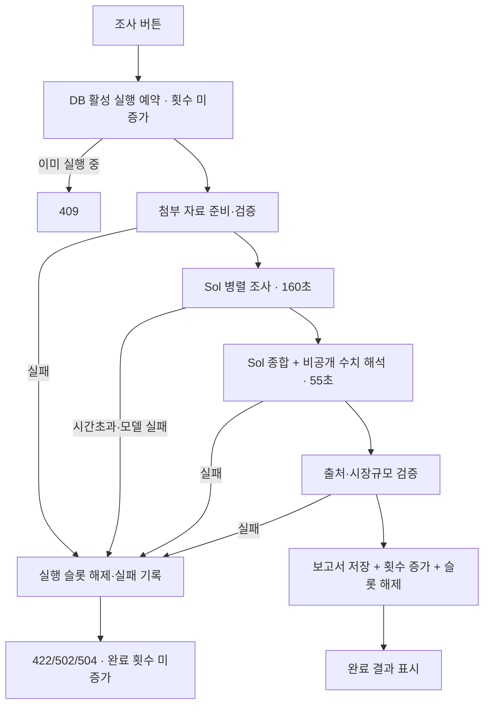

# AI GTM 사전조사 시간초과·복구 개선 설계

상태: 구현 준비 완료
작성일: 2026-08-15
대상: `POST /api/gtm-assistant/research`

## 1. 결론

이번 실패는 입력 부족이나 파일 업로드 오류가 아니라, 하나의 HTTP 요청 안에서 다섯 번의 모델 호출과 최대 18회의 웹 검색을 수행해 Vercel 실행 한도에 도달한 시간초과 문제다.

운영 요청은 약 4분 56초 뒤 HTTP 500으로 종료되었다. Vercel Fluid Compute의 Hobby 함수 최대 실행시간은 300초이므로, 현재 구조는 정상적인 조사에서도 운영 한도와 너무 가깝다.

우선 새 작업 큐를 만들지 않고 다음의 **동기식 시간 예산 방식**으로 안정화한다.

1. Sol 사용 원칙과 기존 보고서 품질·출처 검증은 유지한다.
2. 웹 검색 상한을 18회에서 12회로 줄인다.
3. 조사 수집 단계 160초, 종합 단계 55초, 저장·응답 25초로 총 240초의 서버 내부 한도를 둔다.
4. 플랫폼 오류로 실패한 요청은 조사 횟수를 잃지 않도록 원자적 실행 상태를 관리한다.
5. 조사 버튼과 계획 버튼의 진행 상태를 분리하고, 실패 메시지를 조사 버튼 바로 아래에 표시한다.
6. 각 단계의 소요시간과 실패 지점을 개인정보 없이 운영 로그에 남긴다.

240초 안에 안정적으로 끝나지 않는 비율이 높을 때만 OpenAI Background mode 또는 별도 작업 큐를 도입한다.

## 2. 확인된 현상과 근거

### 운영 증거

- 경로: `POST /api/gtm-assistant/research`
- 결과: HTTP 500
- 실행시간: 약 296.5초
- Vercel 기록: 약 4분 56초 실행 후 종료
- 사용자 화면: `조사하고 있습니다…` 상태가 오래 유지된 뒤 결과와 가까운 위치의 오류 안내가 보이지 않음

### 현재 코드 흐름

`app/api/gtm-assistant/research/route.ts`는 한 요청에서 다음 작업을 수행한다.

1. 업로드 문서가 있으면 검색 없는 모델로 순차 정제
2. 병렬 공개 조사
   - 시장동향: Sol, 웹 검색 최대 4회
   - 경쟁구도: Sol, 웹 검색 최대 6회
   - 시장규모: Sol 고추론, 웹 검색 최대 8회
3. 병렬 후처리
   - Sol 최종 종합
   - 경량 모델 비공개 수치 해석
4. 출처 허용목록·시장규모 규칙 검증
5. DB 저장 후 응답

첫 단계의 최대 18회 웹 검색과 시장규모 고추론이 끝나야 최종 종합을 시작한다. OpenAI SDK의 기본 제한시간은 Vercel 실행 한도보다 길기 때문에, 애플리케이션이 실패를 정리하기 전에 Vercel이 요청을 종료할 수 있다.

### 함께 확인된 문제

- 서버 `catch`에 단계별 오류 로그가 없어 운영 화면에서 실패 원인을 찾기 어렵다.
- 조사와 계획 작성이 하나의 `busy` 상태를 공유해 두 버튼이 동시에 작업 중처럼 표시된다.
- 오류 메시지가 조사 버튼에서 멀리 떨어진 하단에 있어 사용자가 실패를 놓칠 수 있다.
- 조사 횟수를 긴 모델 호출 전에 예약하지만 일반적인 500 실패에는 복구하지 않아, 플랫폼 오류가 3회 한도를 소진할 수 있다.
- 업로드 문서 정제도 예약 이후에 실행되어 잘못된 파일이나 정제 실패가 조사 횟수에 영향을 줄 수 있다.

## 3. 유지해야 할 제품 계약

이번 수정은 조사 품질을 낮추거나 개인정보 경계를 완화하는 작업이 아니다.

- 시장동향·경쟁구도·시장규모·최종 종합은 Sol이 담당한다.
- 비공개 창업자 입력과 정제 문서는 웹 검색 도구가 연결된 요청에 보내지 않는다.
- 선택 입력의 빈 값은 부정적 증거나 근거 공백으로 해석하지 않는다.
- 검색 결과로 반환된 URL만 공개 출처로 허용한다.
- TAM·SAM·SOM·교두보 시장의 서버 재계산과 계층 검증을 유지한다.
- 기존 확정 보고서는 새 조사가 실패해도 덮어쓰지 않는다.
- 구조화된 전체 보고서를 만들지 못하면 부분 결과를 확정 보고서로 저장하지 않는다.

## 4. 검토한 대안

| 대안 | 장점 | 문제 | 결정 |
|---|---|---|---|
| Vercel 상위 요금제로 실행시간만 연장 | 코드 변경이 작음 | 진행·복구·횟수 소진 문제를 해결하지 못하며 실패가 더 늦게 보임 | 채택하지 않음 |
| 동기식 시간 예산·검색 상한·복구 개선 | 현재 구조와 스키마를 재사용하며 빠르게 안정화 가능 | 한 요청 안에서 완료해야 하는 한계는 남음 | **우선 채택** |
| OpenAI Background mode 또는 자체 작업 큐 | 장시간 작업, 폴링, 재접속 복구에 적합 | 상태 저장·폴링·보관정책·운영 복잡도가 크게 증가 | 지표가 필요할 때 2단계로 도입 |

## 5. 권장 설계

### 5.1 서버 시간 예산

Vercel의 300초보다 충분히 앞서 애플리케이션이 직접 종료하고 사용자에게 구조화된 오류를 반환한다.

| 단계 | 최대시간 | 비고 |
|---|---:|---|
| 업로드 문서 준비 | 활성 실행 예약 후, 횟수 증가 전 처리 | 파일 오류는 조사 횟수를 사용하지 않음 |
| 동향·경쟁·시장규모 병렬 조사 | 160초 | 세 요청 모두 같은 상한 적용 |
| 종합·비공개 수치 해석 | 55초 | 첫 단계 성공 후 실행 |
| 검증·DB 저장·HTTP 응답 여유 | 25초 | 전체 서버 한도 240초 |

각 OpenAI 호출에 SDK 요청 제한시간을 명시한다. 첫 병렬 단계가 제한시간을 넘으면 후속 종합을 시작하지 않는다. 애플리케이션은 Vercel 종료 전에 `504 research_timeout`을 반환한다.

### 5.2 검색량과 모델 배분

Sol 사용 원칙은 유지하되 중복 검색을 줄인다.

- 시장동향: 최대 3회
- 경쟁구도: 최대 4회
- 시장규모: 최대 5회
- 총 상한: 최대 12회
- 최종 종합: 웹 검색 없음
- 비공개 수치 해석: 기존 경량 모델, 웹 검색 없음

출처 구성과 경쟁사 최소 요건은 그대로 두되, 개수를 채우기 위해 근거가 약한 항목을 만들지 않는다. 12회로 품질 기준을 반복적으로 충족하지 못하면 검색량을 다시 늘리기 전에 쿼리 중복과 스키마 요구량을 먼저 점검한다.

### 5.3 조사 실행 상태와 횟수

조사 횟수는 **플랫폼 오류 없이 검증 단계까지 완료된 조사**를 기준으로 계산한다. 근거 부족으로 기존 확정 보고서를 보존한 경우에도 모델 조사가 정상 완료되었으므로 1회로 계산한다. 동시에 여러 요청이 비용을 발생시키지 않도록 DB가 실행 중 상태를 원자적으로 소유한다.

`gtm_plans`에 다음 네 필드를 추가하고 작은 RPC 세 개로 상태를 관리한다.

- `market_research_active_attempt_id uuid null`
- `market_research_active_started_at timestamptz null`
- `market_research_failure_count smallint not null default 0`
- `market_research_failure_window_started_at timestamptz null`

동작은 다음과 같다.

1. `reserve_market_research_attempt`: 완료 횟수가 3 미만이고 활성 실행이 없을 때만 UUID와 시작시각을 저장한다.
2. `complete_market_research_attempt`: 같은 UUID일 때만 보고서 처리와 횟수 증가를 한 트랜잭션으로 완료한다.
3. `fail_market_research_attempt`: 같은 UUID일 때만 활성 상태를 해제하고 완료 횟수는 올리지 않으며 실패 횟수를 기록한다.
4. 6분 이상 지난 활성 실행은 다음 예약에서 만료된 것으로 회수한다.
5. 플랫폼 실패 재시도는 계정별 24시간 최대 3회로 제한해 무제한 모델 비용을 막고, 정상 완료 시 실패 창을 초기화한다.

이 구조는 요청 시작 전에 단순히 횟수를 올렸다가 감소시키는 방식보다 동시 요청과 프로세스 강제 종료에 안전하다. 플랫폼 오류 때문에 사용자의 정상 조사 3회를 잃게 하지 않으면서 실패 재시도를 통한 무제한 비용도 막는다. 기존 3회 한도와 일회성 조사 버전 업그레이드 규칙은 유지한다.

### 5.4 오류 계약

API는 사용자 메시지와 운영 식별자를 함께 반환한다.

| 상태 | `code` | 사용자 안내 |
|---:|---|---|
| 409 | `research_in_progress` | 다른 조사가 진행 중입니다. 잠시 후 다시 확인해 주세요. |
| 422 | `document_preparation_failed` | 첨부 자료를 정제하지 못했습니다. 파일을 확인해 주세요. |
| 504 | `research_timeout` | 조사 시간이 예상보다 길어 중단했습니다. 조사 횟수는 차감되지 않았습니다. 다시 시도해 주세요. |
| 502 | `research_model_failed` | AI 조사 연결이 원활하지 않습니다. 조사 횟수는 차감되지 않았습니다. |
| 500 | `research_persistence_failed` | 결과 저장에 실패했습니다. 기존 보고서는 그대로 보존했습니다. |

모델 원문 오류, 스택, 입력 내용은 브라우저에 반환하지 않는다.

### 5.5 UI/UX

`components/gtm-assistant.tsx`의 공유 `busy`를 다음 상태로 분리한다.

- `researchBusy`
- `workshopBusy`
- 기존 `fileBusy`

조사 실행 중에는 조사 버튼만 `조사하고 있습니다…`로 바꾸고 계획 버튼은 작업 중처럼 표시하지 않는다. 계획 버튼은 조사 완료·확인 전이라는 기존 조건으로 비활성화한다.

조사 버튼 바로 아래에 전용 상태 영역을 둔다.

- 시작: `공개자료와 입력 내용을 확인하고 있습니다.`
- 30초 이후: `시장동향·경쟁구도·시장규모를 조사하고 있습니다.`
- 120초 이후: `근거와 계산 결과를 교차검증하고 있습니다.`
- 실패: API의 쉬운 한국어 메시지와 `다시 조사` 버튼

이는 실제 서버 단계라고 단정하는 진행률 막대를 만들지 않고, 기다리는 사용자가 현재 요청이 살아 있음을 알 수 있게 하는 최소 안내다. `aria-live="polite"`를 사용하고 오류는 `role="alert"`로 제공한다.

이전 확정 보고서가 있으면 조사 중과 실패 후에도 화면에 유지한다.

### 5.6 운영 로그

각 요청에 UUID `researchRequestId`를 만들고 다음 정보만 구조화해 기록한다.

- 단계: `documents`, `trends`, `competitors`, `sizing`, `synthesis`, `validation`, `persistence`
- 시작·종료·소요시간
- 모델 이름, 검색 호출 수, 결과 항목 수
- 종료 상태와 정규화된 오류 코드
- 계획 ID의 해시 또는 요청 ID

창업자 입력, 파일명, 문서 내용, 검색어, 모델 응답 원문은 로그에 남기지 않는다.

## 6. 처리 흐름

## 7. 변경 대상

### 필수

- `app/api/gtm-assistant/research/route.ts`
  - 단계별 제한시간, 검색 상한, 오류 코드, 로그, 실행 상태 RPC 적용
  - 문서 준비를 완료 횟수 증가 전에 처리
- `components/gtm-assistant.tsx`
  - 조사·계획 진행 상태 분리
  - 조사 버튼 인접 상태·오류·재시도 UI
- `supabase/migrations/*_market_research_attempt_lifecycle.sql`
  - 활성 실행 필드와 reserve/complete/fail RPC
- `app/api/gtm-assistant/research/route.test.ts`
  - 모델·검색량·제한시간·실패 복구 계약
- `components/gtm-assistant.*.test.tsx`
  - 버튼 상태 분리와 인접 오류 표시

### 기존 검증을 그대로 사용하는 파일

- `lib/gtm-assistant.ts`
- `lib/market-sizing.ts`
- `lib/research-sources.ts`
- `lib/gtm-research-documents.ts`

새 작업 큐, 새 프레임워크, 새 패키지는 추가하지 않는다.

## 8. 테스트 계획

1. 동향 3·경쟁 4·시장규모 5회의 검색 상한이 고정된다.
2. 네 공개 조사·종합 단계가 Sol을 사용하고 비공개 수치 해석은 경량 모델을 사용한다.
3. 병렬 조사 지연을 모의하면 160초 제한에서 후속 종합 없이 `research_timeout`으로 종료한다.
4. 종합 단계 지연도 전체 240초 전에 종료한다.
5. 모델·출처·스키마 실패 시 `fail_market_research_attempt`가 호출되고 조사 횟수는 증가하지 않는다.
6. 성공 시 보고서 저장과 횟수 증가가 같은 RPC에서 한 번만 일어난다.
7. 동시 요청 중 하나만 슬롯을 얻고 나머지는 409를 받는다.
8. 6분 이상 지난 실행 상태는 회수할 수 있다.
9. 24시간 실패 재시도 한도 이후에는 추가 모델 호출 없이 429를 반환한다.
10. 실패해도 기존 확정 보고서와 확인 시각이 보존된다.
11. 비공개 문서·선택 입력이 웹 검색 요청에 포함되지 않는다.
12. 조사 중 계획 버튼에 `계획을 작성하고 있습니다…`가 표시되지 않는다.
13. 실패 안내와 재시도 버튼이 조사 버튼 바로 아래에 표시된다.
14. 한글·영문, 키보드, 320px 화면에서 상태 안내가 정상 동작한다.

## 9. 완료 기준

- 정상 조사 p95 180초 이하
- 모든 요청이 240초 안에 성공 또는 구조화된 실패로 종료
- Vercel 300초 강제 종료 0건
- 플랫폼·모델·저장 실패로 조사 횟수 차감 0건
- 동일 계획의 동시 모델 실행 1건 이하
- 이전 확정 보고서 손실 0건
- 조사 버튼과 계획 버튼의 잘못된 동시 진행 표시 0건
- 오류 단계가 운영 로그만으로 식별 가능
- 관련 테스트, 전체 테스트, 타입 검사, 프로덕션 빌드 통과

## 10. 배포와 관찰

1. DB migration 적용
2. Preview 배포에서 정상·시간초과·동시 요청·기존 보고서 보존을 확인
3. 운영 배포 후 한국어와 영어 계정으로 각 1회 smoke test
4. 최초 24시간 또는 최소 10회 조사에서 단계별 소요시간과 오류 코드를 확인
5. p95가 180초를 넘거나 240초 중단율이 5% 이상이면 2단계 비동기 구조를 검토

롤백은 애플리케이션 배포를 이전 버전으로 되돌리되, 새 DB 필드와 RPC는 호환성 유지를 위해 삭제하지 않는다.

## 11. 비동기 구조 도입 조건

다음 중 하나가 실제 지표로 확인될 때만 OpenAI Background mode 또는 자체 작업 큐를 도입한다.

- 시간 예산 개선 후에도 p95가 180초를 초과
- 240초 제한 중단율이 5% 이상
- 사용자가 조사 중 페이지를 닫고 나중에 돌아오는 요구가 반복됨
- 동시 조사량 때문에 서버 요청 기반 처리가 운영 병목이 됨

Background mode는 장시간 작업과 폴링에 적합하지만 응답 데이터를 일시 보관하므로, 도입 전에 현재 개인정보 고지와 보관정책을 다시 검토해야 한다.

## 12. 공식 참고자료

- [Vercel Functions duration](https://vercel.com/docs/functions/configuring-functions/duration)
- [Vercel Fluid Compute](https://vercel.com/docs/fluid-compute)
- [OpenAI Background mode](https://developers.openai.com/api/docs/guides/background)
- [OpenAI API data controls](https://platform.openai.com/docs/models/default-usage-policies-by-endpoint)
